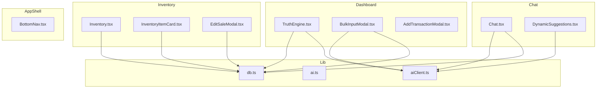

# Design Document: AI Business Manager Upgrade

## Overview

This upgrade adds four major capabilities to the LoopLink platform: the Daily Business Truth Engine (smart insights panel), Bulk Transaction Input (AI-parsed multi-entry mode), Inventory Intelligence (stock depletion predictions and profitability ranking), and Smart AI Context (data-driven follow-up suggestions). It also addresses mobile UX gaps, AI chat search, and inventory sales edit/delete.

The design builds on the existing React + TypeScript + Vite + Tailwind + Supabase + Groq AI (llama-3.3-70b-versatile) stack without introducing new infrastructure dependencies.

---

## Architecture



Data flows are all client-side: components call `db.ts` for Supabase queries and `aiClient.ts` for Groq requests. No new backend services are introduced.

---

## Components and Interfaces

### 1. TruthEngine (`src/components/dashboard/TruthEngine.tsx`)

New component. Renders six Insight_Cards computed from transaction and inventory data.

```typescript
interface TruthEngineData {
  todayPnL: number;                    // sum(income) - sum(expense) for today
  weeklyTrendPct: number;              // % change current 7d vs previous 7d
  topProduct: { name: string; profit: number } | null;
  biggestExpenseCategory: { name: string; total: number } | null;
  anomaly: { description: string; amount: number; category: string } | null;
  aiTip: string | null;                // ≤20 words from Groq
}

interface TruthEngineProps {
  transactions: Transaction[];
  inventoryItems: InventoryItem[];
  inventorySales: InventorySale[];
  businessId: string;
}
```

Key functions (pure, in `src/lib/ai.ts`):

```typescript
// Compute all Truth Engine metrics from raw data
export function computeTruthEngineData(
  transactions: Transaction[],
  inventoryItems: InventoryItem[],
  inventorySales: InventorySale[]
): Omit<TruthEngineData, 'aiTip'>

// Determine insight card color based on value and type
export function getInsightColor(
  value: number,
  type: 'pnl' | 'trend' | 'expense'
): 'green' | 'red' | 'yellow'

// Detect anomaly: transaction > mean + 3*stddev for its category
export function detectAnomaly(
  transactions: Transaction[]
): { description: string; amount: number; category: string } | null
```

Rendering: horizontal scroll (`overflow-x-auto flex gap-3`) on mobile, `grid grid-cols-3` on `md:`. Skeleton loading via `animate-pulse` divs. Refreshes when `transactions` prop changes (parent re-fetches on add/delete).

The CTA on the AI tip card navigates to `/chat`, `/inventory`, or `/dashboard` based on the tip content (simple keyword match on the returned sentence).

### 2. BulkInputModal (`src/components/dashboard/BulkInputModal.tsx`)

New component. Two-step flow: text input → preview.

```typescript
interface ParsedTransaction {
  type: 'income' | 'expense';
  amount: number | null;
  description: string;
  category: string;
  confidence: 'high' | 'low';   // low → yellow warning row
}

interface BulkInputModalProps {
  businessId: string;
  onClose: () => void;
  onSaved: () => void;
}
```

Step 1 — Text Input:
- `<textarea>` min-height 120px on mobile
- Submit button calls `parseTransactions(rawText)` → sets `step = 'preview'`

Step 2 — Preview:
- Editable rows (inline `<input>` fields for type, amount, description, category)
- Delete row button (reduces list length by 1)
- Summary line: `{incomeCount} income · {expenseCount} expense · Net: ₦{net}`
- Confirm button calls `batchSaveTransactions(rows)` → calls `addTransaction` for each row sequentially, then `onSaved()` and `onClose()`
- On error: shows toast, retains preview data

Parser function (in `src/lib/ai.ts`):

```typescript
export async function parseTransactions(
  rawText: string,
  businessId: string
): Promise<ParsedTransaction[]>
```

Prompt sent to Groq:
```
Parse the following text into a JSON array of transactions. Each item must have:
- type: "income" or "expense"
- amount: number (extract numeric value, null if unclear)
- description: string (what the transaction is for)
- category: string (suggest a category like "Food", "Transport", "Sales", etc.)
- confidence: "high" if type and amount are clear, "low" if uncertain

Text: {rawText}

Return ONLY a valid JSON array. No markdown, no explanation.
```

### 3. Inventory Intelligence (updates to `src/pages/Inventory.tsx` + `src/components/inventory/InventoryItemCard.tsx`)

New summary cards at top of inventory page:

```typescript
interface InventorySummary {
  totalItems: number;
  lowStockCount: number;
  topPerformerName: string | null;    // highest profit in 30 days
  highestRevenueName: string | null;  // highest revenue in 30 days
  totalInventoryValue: number;        // sum(quantity * cost_price)
}
```

New computed fields per item (pure functions in `src/lib/ai.ts`):

```typescript
export function computeSalesVelocity(
  sales: InventorySale[],
  itemId: string
): number  // avg units/day over last 30 days

export function computeDepletionDays(
  currentStock: number,
  velocity: number
): number | null  // null when velocity === 0

export function getDepletionLabel(days: number | null): {
  text: string;
  color: 'red' | 'yellow' | 'green' | 'gray';
}
// days <= 7 → red "Runs out in ~X days"
// days 8-14 → yellow "Runs out in ~X days"
// days > 14 → green "~X days of stock remaining"
// null → gray "No sales data"

export function computeItemProfit30d(
  sales: InventorySale[],
  itemId: string
): number  // sum(profit) for sales in last 30 days
```

Badges on `InventoryItemCard`:
- "Top Performer" (amber/gold) — only on the single item with highest 30d profit
- "Low Stock" (red) — when `quantity <= low_stock_threshold`
- "No Recent Sales" (gray) — when 30d sales count = 0

### 4. EditSaleModal (`src/components/inventory/EditSaleModal.tsx`)

New component for editing/deleting inventory sales.

```typescript
interface EditSaleModalProps {
  sale: InventorySale;
  item: InventoryItem;
  onClose: () => void;
  onSaved: () => void;
}
```

Edit saves: updates `inventory_sales` record, recalculates stock delta (old qty vs new qty), updates `inventory_items.quantity`.

Delete flow: confirm dialog → delete `inventory_sales` record → restore `inventory_items.quantity += sale.quantity_sold`.

New db.ts functions:

```typescript
export async function updateInventorySale(
  saleId: string,
  updates: { quantity_sold: number; sale_price_per_unit: number; profit?: number }
): Promise<InventorySale>

export async function deleteInventorySale(
  saleId: string,
  itemId: string,
  quantityToRestore: number
): Promise<void>
```

### 5. BottomNav (update to `src/components/dashboard/AppShell.tsx`)

New `BottomNav` sub-component rendered inside `AppShell`, visible only on `< md` breakpoint.

```typescript
const bottomNavItems = [
  { path: '/dashboard', icon: LayoutDashboard, label: 'Home' },
  { path: '/history', icon: History, label: 'History' },
  { path: null, icon: Plus, label: 'Add', isAction: true },  // opens add modal
  { path: '/inventory', icon: Package, label: 'Inventory' },
  { path: '/chat', icon: MessageSquare, label: 'Chat' },
];
```

Rendered as `fixed bottom-0 left-0 right-0 z-40 md:hidden`. Main content area gets `pb-20 md:pb-0` to avoid overlap. Active item highlighted with `text-primary` and a small dot indicator.

The center "Add" button is visually prominent (larger, gradient background) and opens the transaction mode selector (Simple / Bulk).

### 6. Chat Search (update to `src/pages/Chat.tsx`)

Existing search filters by title client-side. Upgrade: also filter by message content.

```typescript
// In Chat.tsx — replaces current title-only filter
function filterConversations(
  conversations: Conversation[],
  messages: Record<string, Message[]>,
  query: string
): Conversation[]
// Returns conversations where query appears in title OR any message.content (case-insensitive)
```

Debounced 300ms via `useDebounce` hook. When query is empty, returns full list (idempotent clear).

For Supabase full-text search (optional enhancement, Req 13.5): add a GIN index on `chat_messages.content` and use `.textSearch('content', query)` when the loaded message cache misses.

### 7. Smart AI Context (update to `src/lib/aiClient.ts`)

Extend `buildContextMessage` to include richer business context:

```typescript
export interface EnhancedAIRequestPayload extends AIRequestPayload {
  monthlyIncome?: number;
  monthlyExpenses?: number;
  monthlyProfit?: number;
  profitTrend?: 'up' | 'down' | 'flat';
  topInventoryItems?: { name: string; unitsSold: number; revenue: number }[];
  lowStockItems?: { name: string; quantity: number }[];
  totalInventoryValue?: number;
}
```

System prompt addition (appended to existing `SYSTEM_PROMPT`):
```
When answering business questions, always reference specific figures from the provided context (income totals, expense categories, product names, stock levels). Never give generic advice when real data is available.
```

### 8. Dynamic Suggestions (update to `src/pages/Chat.tsx`)

After each completed AI response, fire a non-streaming `aiRequest` to generate follow-up chips:

```typescript
async function generateSuggestions(
  assistantResponse: string,
  businessContext: string
): Promise<string[]>  // 2-4 suggestion strings
```

Prompt:
```
Based on this business advisor response, generate 2-4 short follow-up questions a business owner might ask next. Return ONLY a JSON array of strings. Each question should be under 10 words.

Response: {assistantResponse}
```

Suggestions rendered as `<button>` chips below the assistant message, only after streaming completes (`isStreaming === false`). Tapping a chip calls `sendMessage(chipText)`.

---

## Data Models

No new Supabase tables are required. All new features use existing tables.

### Existing tables used:
- `transactions` — Truth Engine, Bulk Input, Smart AI Context
- `inventory_items` — Inventory Intelligence, Depletion Prediction
- `inventory_sales` — Inventory Intelligence, Edit/Delete Sales
- `chat_conversations` — Chat Search
- `chat_messages` — Chat Search (content filter)

### New SQL index for chat search performance:

```sql
-- Enable full-text search on chat message content
CREATE INDEX IF NOT EXISTS idx_chat_messages_content_fts
  ON chat_messages USING gin(to_tsvector('english', content));

-- Index for filtering sales by item and date range
CREATE INDEX IF NOT EXISTS idx_inventory_sales_item_created
  ON inventory_sales (item_id, created_at DESC);
```

### Computed fields (client-side, not stored):

| Field | Computation | Used In |
|---|---|---|
| `todayPnL` | `sum(income) - sum(expense)` where `date(created_at) = today` | TruthEngine |
| `weeklyTrendPct` | `(currentWeekRevenue - prevWeekRevenue) / prevWeekRevenue * 100` | TruthEngine |
| `salesVelocity` | `sum(quantity_sold last 30d) / 30` | InventoryItemCard |
| `depletionDays` | `currentStock / salesVelocity` | InventoryItemCard |
| `itemProfit30d` | `sum(profit) for sales in last 30d` | InventoryItemCard, TruthEngine |
| `anomalyFlag` | `amount > mean + 3*stddev` for category | TruthEngine |

---

## Correctness Properties

*A property is a characteristic or behavior that should hold true across all valid executions of a system — essentially, a formal statement about what the system should do. Properties serve as the bridge between human-readable specifications and machine-verifiable correctness guarantees.*

### Property 1: Today's P&L arithmetic invariant

*For any* set of transactions, `computeTruthEngineData` should return a `todayPnL` equal to the sum of all income transactions minus the sum of all expense transactions whose `created_at` date matches the current calendar day.

**Validates: Requirements 2.1**

---

### Property 2: Weekly trend percentage formula

*For any* two non-negative revenue totals `currentWeek` and `prevWeek` where `prevWeek > 0`, the computed weekly trend percentage should equal `(currentWeek - prevWeek) / prevWeek * 100`, rounded to one decimal place.

**Validates: Requirements 2.2**

---

### Property 3: Top performer selection invariant

*For any* list of inventory items with associated 30-day sales data, the item identified as "top performer" should be the one with the maximum value of `sum(profit)` across all its sales in the past 30 days. No other item should have a higher 30-day profit total.

**Validates: Requirements 2.3, 8.2**

---

### Property 4: Highest expense category selection

*For any* set of expense transactions, the identified "biggest expense category" should be the category whose total spend is greater than or equal to the total spend of every other category in the current month.

**Validates: Requirements 2.4**

---

### Property 5: Anomaly detection statistical invariant

*For any* set of transactions within a single category, a transaction should be flagged as an anomaly if and only if its amount exceeds `mean(amounts) + 3 * stddev(amounts)` for that category. Transactions at or below this threshold should never be flagged.

**Validates: Requirements 2.5**

---

### Property 6: AI tip word count constraint

*For any* AI tip string returned by the Truth Engine, the string should contain no more than 20 words when split on whitespace. The truncation/validation logic should enforce this bound regardless of what Groq returns.

**Validates: Requirements 2.6**

---

### Property 7: Truth Engine refresh on transaction change

*For any* initial set of transactions, after adding a new transaction with a known amount, the recomputed `todayPnL` should differ from the original by exactly that transaction's amount (positive for income, negative for expense).

**Validates: Requirements 2.8**

---

### Property 8: Bulk parse prompt completeness

*For any* raw input text, the prompt string constructed by `parseTransactions` should contain the four required extraction fields: "type", "amount", "description", and "category". The prompt should also contain the raw input text verbatim.

**Validates: Requirements 4.2**

---

### Property 9: Bulk preview row count matches parse output

*For any* parsed transaction array of length N, the Bulk_Preview should render exactly N rows before any user deletions. After deleting K rows, the preview should render exactly N - K rows.

**Validates: Requirements 4.4, 5.2**

---

### Property 10: Bulk preview color coding

*For any* parsed transaction, the row background color should be green (`bg-emerald-*`) when `type === 'income'` and red (`bg-red-*`) when `type === 'expense'`. No income row should have a red background and no expense row should have a green background.

**Validates: Requirements 4.5**

---

### Property 11: Bulk preview summary arithmetic

*For any* list of parsed transactions, the summary line should show: income count = number of rows where `type === 'income'`, expense count = number of rows where `type === 'expense'`, and net amount = `sum(income amounts) - sum(expense amounts)`.

**Validates: Requirements 5.6**

---

### Property 12: Batch save round-trip

*For any* confirmed Bulk_Preview with N rows, after `batchSaveTransactions` completes successfully, exactly N new transaction records should exist in Supabase with the same type, amount, description, and category as the preview rows.

**Validates: Requirements 5.3**

---

### Property 13: Chat context completeness

*For any* user message sent in AI_Chat, the Groq request payload should contain: `monthlyIncome`, `monthlyExpenses`, `monthlyProfit`, `profitTrend`, and at least the most recent transactions (up to 20). When inventory data is present, the payload should additionally contain `topInventoryItems`, `lowStockItems`, and `totalInventoryValue`.

**Validates: Requirements 6.1, 6.2**

---

### Property 14: AI response pass-through

*For any* AI response string returned by Groq, the text rendered in the chat UI should be identical to the response string. No characters should be added, removed, or modified during rendering.

**Validates: Requirements 6.4**

---

### Property 15: Dynamic suggestions count invariant

*For any* completed (non-streaming) AI response, the generated suggestions array should have length between 2 and 4 inclusive. An empty array or an array with more than 4 items should never be rendered as chips.

**Validates: Requirements 7.1**

---

### Property 16: Suggestions suppressed during streaming

*For any* message where `isStreaming === true`, the suggestions chips for that message should not be rendered (the suggestions array for that message should be null or empty). Suggestions should only appear after streaming completes.

**Validates: Requirements 7.4**

---

### Property 17: Suggestion chip sends correct message

*For any* suggestion chip with text T, tapping that chip should result in `sendMessage` being called with exactly T as the argument. The sent message text should equal the chip label text.

**Validates: Requirements 7.3**

---

### Property 18: Inventory summary metrics correctness

*For any* inventory dataset, `computeInventorySummary` should return: `totalItems` = count of all items, `lowStockCount` = count of items where `quantity <= low_stock_threshold`, `totalInventoryValue` = `sum(quantity * cost_price)` for all non-service items.

**Validates: Requirements 8.1**

---

### Property 19: Low stock badge invariant

*For any* inventory item, the "Low Stock" badge should be displayed if and only if `quantity <= low_stock_threshold`. Items above their threshold should never show the badge; items at or below should always show it.

**Validates: Requirements 8.3**

---

### Property 20: Depletion prediction formula and color classification

*For any* inventory item with `salesVelocity > 0`, `computeDepletionDays(stock, velocity)` should equal `Math.round(stock / velocity)`. The color classification should be: red when `days <= 7`, yellow when `8 <= days <= 14`, green when `days > 14`. When `velocity === 0`, the result should be `null` and the label should be "No sales data".

**Validates: Requirements 9.1, 9.2, 9.3, 9.4, 9.5, 9.6**

---

### Property 21: Delete sale restores stock

*For any* inventory sale record with `quantity_sold = Q` associated with item I, after `deleteInventorySale` completes, item I's `quantity` in Supabase should equal its pre-deletion quantity plus Q. The stock restoration should be exact — no more, no less.

**Validates: Requirements 10.5**

---

### Property 22: Edit sale round-trip

*For any* inventory sale record, after `updateInventorySale` is called with new values, the record retrieved from Supabase should have `quantity_sold` and `sale_price_per_unit` equal to the updated values. The item's stock level should be adjusted by the delta between old and new `quantity_sold`.

**Validates: Requirements 10.3**

---

### Property 23: Bottom nav active state

*For any* current route path, the Bottom_Nav item whose `path` matches the current route should have the active indicator class applied. No other nav item should have the active indicator class simultaneously.

**Validates: Requirements 11.3**

---

### Property 24: Chat search filter correctness

*For any* search query string Q and any set of conversations with their messages, `filterConversations(conversations, messages, Q)` should return only conversations where Q appears (case-insensitive) in the conversation title OR in the content of at least one message. Conversations that do not contain Q in either location should be excluded.

**Validates: Requirements 13.2, 13.5**

---

### Property 25: Chat search clear restores full list

*For any* conversation list, calling `filterConversations(conversations, messages, '')` (empty query) should return the complete original list. Clearing the search input should be idempotent — applying it multiple times should always return the same full list.

**Validates: Requirements 13.4**

---

### Property 26: Insight card color coding

*For any* numeric metric value passed to `getInsightColor`, the returned color should be: green when the value is positive/healthy (positive P&L, positive trend), red when negative/loss (negative P&L, negative trend), and yellow for warnings (anomaly detected, trend near zero). The color assignment should be deterministic for any given value and type.

**Validates: Requirements 1.3**

---

## Error Handling

**TruthEngine AI tip failure**: If the Groq request for the AI tip fails or times out, the tip card renders "Check your AI Chat for personalized advice" as a static fallback. The other five cards still render with computed data.

**Bulk parse failure**: If Groq returns invalid JSON or an empty array, the modal shows an inline error: "Couldn't parse your input. Try rephrasing or add entries one at a time." The text area retains the original input.

**Bulk batch save partial failure**: If one `addTransaction` call fails mid-batch, the modal shows an error toast with the count of successfully saved transactions and retains the full preview for retry.

**Inventory sale edit/delete conflict**: If the item's stock would go negative after restoring a deleted sale (e.g., stock was manually adjusted), the operation proceeds but shows a warning toast.

**Chat search with no results**: Renders a "No conversations found" empty state with a "Clear search" button.

**Dynamic suggestions failure**: If the suggestions Groq call fails, no chips are rendered. The chat remains fully functional without suggestions.

---

## Testing Strategy

### Dual Testing Approach

Both unit tests and property-based tests are required. Unit tests cover specific examples, integration points, and edge cases. Property tests verify universal correctness across all inputs.

### Property-Based Testing

Library: **fast-check** (already available in the project's ecosystem, works with Vitest).

Install: `npm install --save-dev fast-check`

Each property test runs a minimum of 100 iterations. Tests are tagged with a comment referencing the design property.

```typescript
// Feature: ai-business-manager-upgrade, Property 1: Today's P&L arithmetic invariant
it('computeTruthEngineData todayPnL equals income minus expense for today', () => {
  fc.assert(fc.property(
    fc.array(arbitraryTransaction()),
    (transactions) => {
      const today = new Date().toISOString().split('T')[0];
      const todayTx = transactions.filter(t => t.created_at.startsWith(today));
      const expected = todayTx.filter(t => t.type === 'income').reduce((s, t) => s + t.amount, 0)
                     - todayTx.filter(t => t.type === 'expense').reduce((s, t) => s + t.amount, 0);
      const result = computeTruthEngineData(transactions, [], []);
      return result.todayPnL === expected;
    }
  ), { numRuns: 100 });
});
```

Properties to implement as property-based tests: 1, 2, 3, 4, 5, 6, 7, 8, 9, 10, 11, 12, 13, 14, 15, 16, 17, 18, 19, 20, 21, 22, 23, 24, 25, 26.

### Unit Tests

Unit tests focus on:
- Edge cases: empty transaction list, single transaction, zero velocity, velocity = 0 for depletion
- Integration: `deleteInventorySale` correctly calls both the delete and the stock restore in sequence
- Error paths: Groq API failure falls back gracefully in TruthEngine and BulkInputModal
- UI state: skeleton renders when `isLoading = true`, placeholder renders when `todayTransactions.length < 3`
- Specific examples: anomaly detection with known mean/stddev values

### Test file locations

```
src/test/
  truthEngine.test.ts       — Properties 1-7, 26
  bulkInput.test.ts         — Properties 8-12
  chatContext.test.ts       — Properties 13-17
  inventoryIntelligence.test.ts — Properties 18-22
  appShell.test.ts          — Property 23
  chatSearch.test.ts        — Properties 24-25
```
