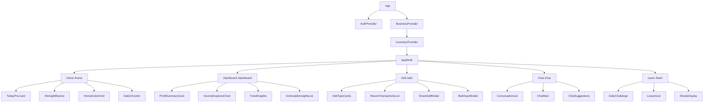
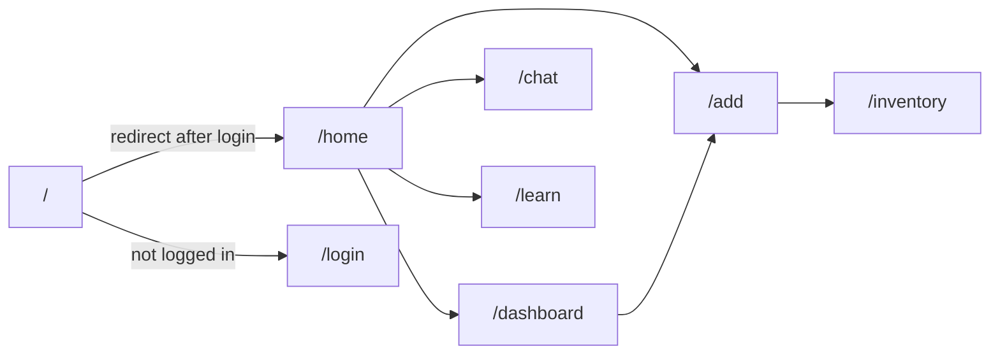
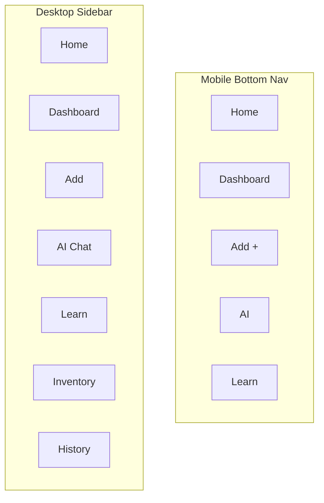
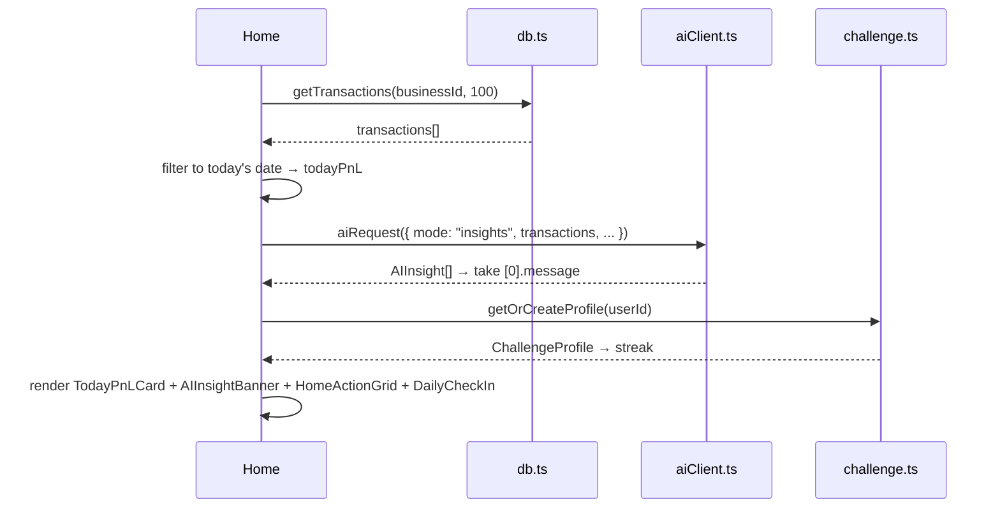
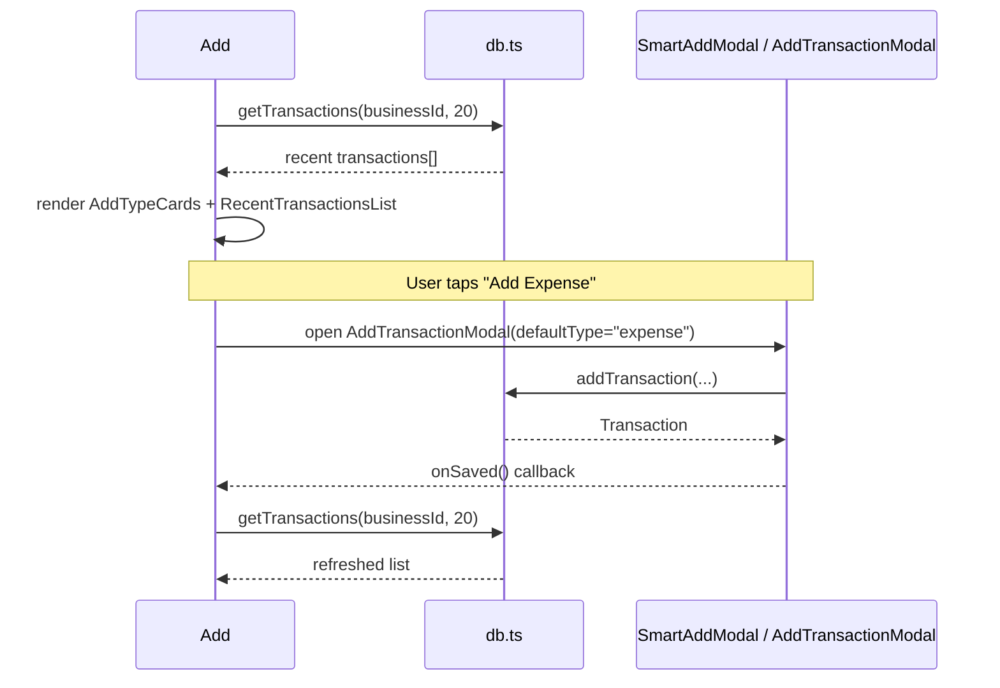
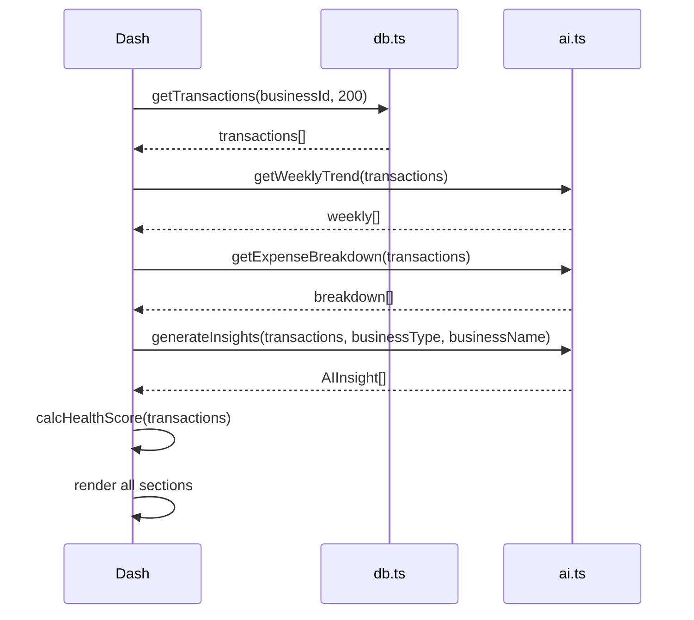
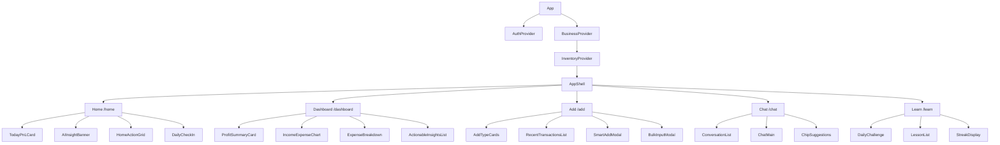
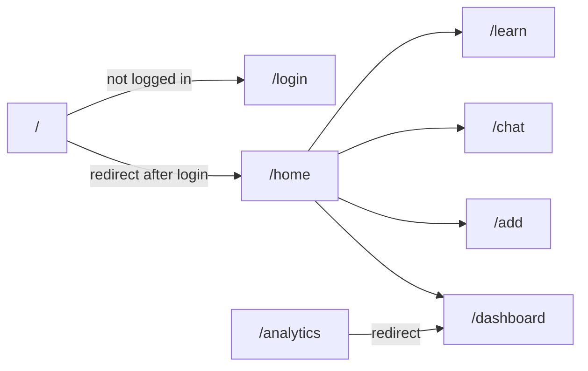
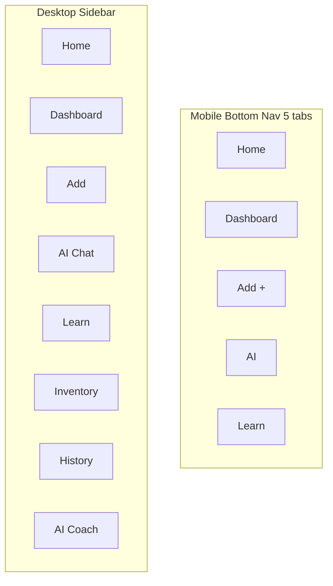

# Design Document — LoopLink App Restructure

## Overview

This restructure reorganizes LoopLink's navigation and page architecture from a 6-tab sidebar-heavy layout into a focused 5-section mobile-first experience. The goal is to reduce cognitive load, surface the most important information immediately, and make every screen answer "what should I do next?" for a small business owner.

The restructure is **additive and reorganizational** — no data layer, context, or Supabase schema changes are required. All existing components, hooks, and lib functions are preserved. The work is primarily: creating two new pages (`Home`, `Add`), merging two existing pages (`Dashboard` + `Analytics` → new `Dashboard`), renaming one page (`DailyChallenge` → `Learn`), updating `AppShell` navigation, and updating `App.tsx` routes.

Stack: React + TypeScript + Vite + Tailwind CSS + Supabase + Groq AI (llama-3.3-70b-versatile)

---

## Architecture

### High-Level Component Map (After Restructure)



### Route Map



### Navigation Structure



---

## Page & Route Structure

| Route | Page File | Status | Description |
|---|---|---|---|
| `/` or `/home` | `pages/Home.tsx` | **NEW** | Landing screen after login |
| `/dashboard` | `pages/Dashboard.tsx` | **MODIFIED** | Merged Dashboard + Analytics |
| `/add` | `pages/Add.tsx` | **NEW** | Dedicated add screen |
| `/chat` | `pages/Chat.tsx` | **KEEP** (minor improvements) | AI Chat |
| `/learn` | `pages/Learn.tsx` | **NEW** (wraps DailyChallenge) | Learn + streaks |
| `/inventory` | `pages/Inventory.tsx` | **KEEP** | Inventory management |
| `/history` | `pages/History.tsx` | **KEEP** | Transaction history |
| `/analytics` | `pages/Analytics.tsx` | **DEPRECATED** (redirect to /dashboard) | |
| `/coach` | `pages/Coach.tsx` | **KEEP** (accessible via sidebar/more) | AI Coach |

---

## What Gets Reused vs Created New

### Reused (no changes)
- `src/context/AuthContext.tsx`
- `src/context/BusinessContext.tsx`
- `src/context/InventoryContext.tsx`
- `src/lib/db.ts`
- `src/lib/ai.ts`
- `src/lib/aiClient.ts`
- `src/lib/supabase.ts`
- `src/lib/challenge.ts`
- `src/lib/challengeQuestions.ts`
- `src/components/dashboard/SmartAddModal.tsx`
- `src/components/dashboard/BulkInputModal.tsx`
- `src/components/dashboard/AddTransactionModal.tsx`
- `src/components/dashboard/DailyChallenge.tsx`
- `src/components/dashboard/TruthEngine.tsx`
- `src/components/dashboard/DailyWelcome.tsx`
- `src/components/inventory/*` (all inventory components)
- `src/pages/Inventory.tsx`
- `src/pages/History.tsx`
- `src/pages/Coach.tsx`
- `src/pages/Chat.tsx` (minor UX improvements only)

### Modified
- `src/components/dashboard/AppShell.tsx` — update nav items, labels, routes
- `src/pages/Dashboard.tsx` — merge Analytics content in, simplify layout
- `src/App.tsx` — add new routes, redirect `/` to `/home`

### Created New
- `src/pages/Home.tsx` — new home screen
- `src/pages/Add.tsx` — dedicated add screen
- `src/pages/Learn.tsx` — wraps DailyChallenge + lesson list

---

## Components and Interfaces

### AppShell.tsx — Navigation Changes

The bottom nav and sidebar nav items are updated to reflect the new 5-section structure.

```typescript
// New mobile bottom nav items (5 tabs)
const mobileNavItems = [
  { path: "/home",      icon: House,         label: "Home" },
  { path: "/dashboard", icon: BarChart3,      label: "Dashboard" },
  // center Add button — navigates to /add instead of opening SmartAddModal
  { path: "/chat",      icon: MessageSquare,  label: "AI" },
  { path: "/learn",     icon: GraduationCap,  label: "Learn" },
];

// Desktop sidebar nav items (full list)
const desktopNavItems = [
  { path: "/home",      icon: House,         label: "Home" },
  { path: "/dashboard", icon: BarChart3,      label: "Dashboard" },
  { path: "/add",       icon: PlusCircle,     label: "Add" },
  { path: "/chat",      icon: MessageSquare,  label: "AI Chat" },
  { path: "/learn",     icon: GraduationCap,  label: "Learn" },
  { path: "/inventory", icon: Package,        label: "Inventory" },
  { path: "/history",   icon: History,        label: "History" },
];
```

Key change: the center "Add" button in the mobile bottom nav now navigates to `/add` instead of opening `SmartAddModal` inline. This gives the Add screen its own dedicated space with more options.

The "More" sheet is simplified — it now only contains: Inventory, History, AI Coach, business switcher, and logout.

---

### Home.tsx — New Page

The entry point after login. Answers: "How am I doing today and what should I do next?"

```typescript
interface HomeProps {} // no props — reads from context

// Data loaded on mount
interface HomeData {
  todayIncome: number;
  todayExpenses: number;
  todayPnL: number;        // todayIncome - todayExpenses
  topAIInsight: string;    // single sentence from generateInsights()
  streak: number;          // from challenge profile
  hasRecordedToday: boolean; // any transaction created today
}
```

**Layout (mobile-first, single column):**

1. **TodayPnLCard** — large number, green/red, "Today's Profit/Loss"
2. **AIInsightBanner** — single sentence AI insight, tappable → navigates to `/dashboard`
3. **HomeActionGrid** — 2×2 grid of large action cards (min 80px tall each):
   - Add Transaction → opens `SmartAddModal`
   - View Dashboard → `/dashboard`
   - Ask AI → `/chat`
   - Learn → `/learn`
4. **DailyCheckIn** — "Have you recorded today's transactions?" + activity streak badge

```typescript
// HomeActionGrid card definition
interface HomeAction {
  label: string;
  icon: LucideIcon;
  color: string;       // Tailwind bg color class
  iconColor: string;   // Tailwind text color class
  onPress: () => void;
}

const homeActions: HomeAction[] = [
  { label: "Add Transaction", icon: Plus,         color: "bg-emerald-50", iconColor: "text-emerald-600", onPress: () => setShowSmartAdd(true) },
  { label: "View Dashboard",  icon: BarChart3,    color: "bg-blue-50",    iconColor: "text-blue-600",    onPress: () => navigate("/dashboard") },
  { label: "Ask AI",          icon: Sparkles,     color: "bg-violet-50",  iconColor: "text-violet-600",  onPress: () => navigate("/chat") },
  { label: "Learn",           icon: GraduationCap,color: "bg-amber-50",   iconColor: "text-amber-600",   onPress: () => navigate("/learn") },
];
```

**Data loading strategy:** Load only today's transactions (filter by today's date from the last 100 fetched). AI insight is a single `aiRequest` call with `mode: "insights"` — take the first result. Cache in component state; don't re-fetch on every render.

---

### Dashboard.tsx — Modified (Merged with Analytics)

Replaces the current Dashboard + Analytics split. Answers: "How is my business performing overall?"

```typescript
interface DashboardData {
  income: number;
  expenses: number;
  profit: number;
  margin: number;
  weeklyTrend: ReturnType<typeof getWeeklyTrend>;
  expenseBreakdown: ReturnType<typeof getExpenseBreakdown>;
  insights: AIInsight[];
  health: HealthScore;
}
```

**Layout (mobile-first):**

1. **ProfitSummaryCard** — income / expenses / net profit in a 3-col row, plain language label ("You made ₦X profit this month")
2. **IncomeExpenseChart** — the existing weekly bar chart from `Analytics.tsx`, moved here
3. **ExpenseBreakdown** — the existing breakdown bars from `Analytics.tsx`, moved here
4. **ActionableInsightsList** — AI insights rendered as plain-language cards ("You are losing money on Transport")
5. **InventorySummaryWidget** — existing widget from current Dashboard (kept as-is)
6. **BusinessHealthPanel** — existing health score ring (kept as-is)

The current `Analytics.tsx` page is kept but renders a redirect to `/dashboard`. The `Coach.tsx` page remains accessible via the desktop sidebar and the "More" sheet on mobile.

---

### Add.tsx — New Page

Dedicated screen for all data entry. Answers: "How do I record something?"

```typescript
interface AddPageState {
  showSmartAdd: boolean;
  showBulkInput: boolean;
  addType: "income" | "expense" | null;
  transactions: Transaction[];  // recent 20 for the list below
}
```

**Layout:**

1. **AddTypeCards** — 3 large cards in a row (or 2+1 on mobile):
   - Add Expense (red) → opens `AddTransactionModal` with `defaultType="expense"`
   - Add Income (green) → opens `AddTransactionModal` with `defaultType="income"`
   - Add Inventory → navigates to `/inventory`
2. **BulkInputButton** — secondary button: "Bulk Input (AI)" → opens `BulkInputModal`
3. **RecentTransactionsList** — last 20 transactions with edit/delete (reuse the row component from `History.tsx`)

```typescript
// AddTypeCard definition
interface AddTypeCard {
  label: string;
  description: string;
  icon: LucideIcon;
  bgColor: string;
  iconColor: string;
  onPress: () => void;
}

const addCards: AddTypeCard[] = [
  {
    label: "Add Expense",
    description: "Record a cost or payment",
    icon: ArrowDownRight,
    bgColor: "bg-red-50 border-red-200",
    iconColor: "text-red-500",
    onPress: () => { setAddType("expense"); setShowSmartAdd(true); },
  },
  {
    label: "Add Income",
    description: "Record a sale or payment received",
    icon: ArrowUpRight,
    bgColor: "bg-emerald-50 border-emerald-200",
    iconColor: "text-emerald-600",
    onPress: () => { setAddType("income"); setShowSmartAdd(true); },
  },
  {
    label: "Add Inventory",
    description: "Manage products and stock",
    icon: Package,
    bgColor: "bg-blue-50 border-blue-200",
    iconColor: "text-blue-600",
    onPress: () => navigate("/inventory"),
  },
];
```

---

### Learn.tsx — New Page (wraps DailyChallenge)

Replaces the embedded `DailyChallenge` on the Dashboard. Answers: "What can I learn today?"

```typescript
interface LearnPageState {
  transactions: Transaction[];  // passed to DailyChallenge for context-aware questions
}
```

**Layout:**

1. **StreakDisplay** — prominent streak counter at the top (reuses data from `DailyChallenge` profile)
2. **DailyChallenge** — the existing `DailyChallenge` component, rendered full-width (not collapsed by default on this page)
3. **LessonList** — static list of short financial literacy tips (no DB required), rendered as expandable cards

```typescript
// Static lesson definition
interface Lesson {
  id: string;
  title: string;
  category: "profit" | "expenses" | "pricing" | "growth" | "savings";
  content: string;   // 2-3 sentences
  readTime: number;  // minutes
}
```

The `DailyChallenge` component is rendered with `defaultCollapsed={false}` on this page (add an optional prop to the existing component).

---

### Chat.tsx — Minor Improvements Only

No structural changes. Two small additions:

1. **Context-based suggestions** — the `SUGGESTED_PROMPTS` array is replaced with dynamically generated prompts based on the user's actual data (top expense category, profit trend). Generated once on mount via a lightweight `aiRequest` call.

2. **Typing indicator improvement** — the existing 3-dot bounce animation is already implemented; no change needed.

The existing conversation history, streaming, chip generation, and Supabase persistence all remain unchanged.

---

## Data Flow

### Home Screen Data Flow



### Add Screen Data Flow



### Dashboard (Merged) Data Flow



---

## Navigation Logic

### Mobile Bottom Nav (5 tabs)

```typescript
// Active state detection — exact match for all except Add
const isActive = (path: string) => location.pathname === path;

// Center Add tab — always navigates to /add, no modal
// Styled as raised pill button (existing gradient style preserved)
```

Tab order and behavior:
- **Home** (`/home`) — active on `/home` and `/`
- **Dashboard** (`/dashboard`) — active on `/dashboard`
- **Add** (`/add`) — center raised button, navigates to `/add`
- **AI** (`/chat`) — active on `/chat`
- **Learn** (`/learn`) — active on `/learn`

The "More" bottom sheet is kept for: Inventory, History, AI Coach, business switcher, delete business, logout.

### Desktop Sidebar

Full nav list — all 7 items visible:
Home, Dashboard, Add, AI Chat, Learn, Inventory, History.

Coach remains in the sidebar as a secondary item below the main 5.

### Route Redirects

```typescript
// App.tsx additions
<Route path="/" element={<Navigate to="/home" replace />} />
<Route path="/home" element={<Home />} />
<Route path="/add" element={<Add />} />
<Route path="/learn" element={<Learn />} />
// /analytics redirects to /dashboard
<Route path="/analytics" element={<Navigate to="/dashboard" replace />} />
```

---

## Key Component Signatures

### Home.tsx

```typescript
// src/pages/Home.tsx
const Home: React.FC = () => {
  const { user, loading: authLoading } = useAuth();
  const { businesses, activeBusiness, setActiveBusiness, loading: bizLoading } = useBusiness();
  const navigate = useNavigate();

  const [todayPnL, setTodayPnL] = useState<number>(0);
  const [topInsight, setTopInsight] = useState<string>("");
  const [streak, setStreak] = useState<number>(0);
  const [hasRecordedToday, setHasRecordedToday] = useState<boolean>(false);
  const [showSmartAdd, setShowSmartAdd] = useState<boolean>(false);
  const [loading, setLoading] = useState<boolean>(true);

  // Loads today's P&L, top AI insight, streak
  const loadHomeData: () => Promise<void>;

  return (
    <AppShell businesses={businesses} activeBusiness={activeBusiness} onSelectBusiness={setActiveBusiness}>
      <TodayPnLCard pnl={todayPnL} />
      <AIInsightBanner insight={topInsight} onClick={() => navigate("/dashboard")} />
      <HomeActionGrid actions={homeActions} />
      <DailyCheckIn hasRecorded={hasRecordedToday} streak={streak} />
      {showSmartAdd && activeBusiness && (
        <SmartAddModal businessId={activeBusiness.id} onClose={() => setShowSmartAdd(false)} onSaved={loadHomeData} />
      )}
    </AppShell>
  );
};
```

### Add.tsx

```typescript
// src/pages/Add.tsx
const Add: React.FC = () => {
  const { businesses, activeBusiness, setActiveBusiness } = useBusiness();
  const navigate = useNavigate();

  const [transactions, setTransactions] = useState<Transaction[]>([]);
  const [showAddModal, setShowAddModal] = useState<boolean>(false);
  const [showBulkModal, setShowBulkModal] = useState<boolean>(false);
  const [addType, setAddType] = useState<"income" | "expense">("income");
  const [editingTx, setEditingTx] = useState<Transaction | null>(null);

  const loadRecent: () => Promise<void>; // getTransactions(businessId, 20)

  return (
    <AppShell businesses={businesses} activeBusiness={activeBusiness} onSelectBusiness={setActiveBusiness}>
      <AddTypeCards cards={addCards} />
      <BulkInputButton onClick={() => setShowBulkModal(true)} />
      <RecentTransactionsList
        transactions={transactions}
        onEdit={(tx) => setEditingTx(tx)}
        onDelete={handleDelete}
        onRefresh={loadRecent}
      />
      {showAddModal && activeBusiness && (
        <AddTransactionModal
          businessId={activeBusiness.id}
          defaultType={addType}
          onClose={() => setShowAddModal(false)}
          onSaved={loadRecent}
        />
      )}
      {showBulkModal && activeBusiness && (
        <BulkInputModal
          businessId={activeBusiness.id}
          onClose={() => setShowBulkModal(false)}
          onSaved={loadRecent}
        />
      )}
    </AppShell>
  );
};
```

### Learn.tsx

```typescript
// src/pages/Learn.tsx
const Learn: React.FC = () => {
  const { businesses, activeBusiness, setActiveBusiness } = useBusiness();
  const [transactions, setTransactions] = useState<Transaction[]>([]);

  // Loads transactions to pass to DailyChallenge for context-aware questions
  const loadTransactions: () => Promise<void>;

  return (
    <AppShell businesses={businesses} activeBusiness={activeBusiness} onSelectBusiness={setActiveBusiness}>
      <DailyChallenge transactions={transactions} defaultCollapsed={false} />
      <LessonList lessons={STATIC_LESSONS} />
    </AppShell>
  );
};
```

### DailyChallenge.tsx — Prop Addition

```typescript
// Add optional prop to existing component
interface Props {
  transactions: Transaction[];
  defaultCollapsed?: boolean;  // NEW — defaults to true (existing behavior preserved)
}

// Inside component, change initial state:
const [collapsed, setCollapsed] = useState(defaultCollapsed ?? true);
```

---

## UX Improvements Per Screen

### Home
- Single prominent number (today's P&L) — no tables, no lists above the fold
- AI insight is one sentence max, tappable for more detail
- Action grid uses min 80px card height, large icons, clear labels
- Daily check-in is a soft nudge, not a blocker
- No DailyChallenge on this screen (moved to Learn)

### Dashboard
- Replaces the current split between Dashboard and Analytics
- Plain language summary at top: "You made ₦X profit" not just a number
- Charts are below the fold — summary first, data second
- Actionable insights use color-coded cards (existing pattern preserved)
- Removed: DailyChallenge widget (moved to Learn), Quick Actions (moved to Home)

### Add
- Three large cards replace the SmartAddModal menu — more discoverable
- Recent transactions visible immediately — no navigation needed to see/edit them
- Edit and delete inline — no need to go to History for quick corrections
- Bulk input is a secondary action, not hidden

### AI Chat
- Suggested prompts are data-driven (e.g. "Why are my Transport costs high?" based on actual top expense)
- No structural changes — existing streaming, history, chips all preserved

### Learn
- DailyChallenge is expanded by default (not collapsed)
- Streak is prominent at the top
- Static lessons provide value even when challenge is already completed
- Lightweight — no new DB tables required

---

## Error Handling

| Scenario | Handling |
|---|---|
| Home AI insight fails to load | Show empty string — no error shown to user, insight banner hidden |
| Home today P&L has no transactions | Show ₦0 with neutral color (not red) |
| Add page transaction delete fails | Toast error, list not refreshed |
| Learn page challenge DB unavailable | Existing local fallback in `DailyChallenge` handles this |
| `/analytics` route visited | Redirect to `/dashboard` via `<Navigate>` |
| Auth redirect on protected pages | All new pages (`Home`, `Add`, `Learn`) follow existing pattern: `if (!user) navigate("/login")` |

---

## Testing Strategy

### Unit Tests

Key test files to create or update:

- `src/test/Home.test.tsx` — renders TodayPnLCard, AIInsightBanner, HomeActionGrid, DailyCheckIn; action card navigation targets
- `src/test/Add.test.tsx` — renders 3 add cards; opens correct modal per card; recent list renders; edit/delete actions
- `src/test/Learn.test.tsx` — DailyChallenge rendered with `defaultCollapsed=false`; lesson list renders
- `src/test/AppShell.test.tsx` — bottom nav has 5 items; Add tab navigates to `/add`; More sheet contains Inventory/History/Coach

### Property-Based Testing

Use **fast-check** (already in the project pattern from prior specs).

Each property test includes a comment: `// Feature: app-restructure, Property N: <description>`

---

## Correctness Properties

### Property 1: Today P&L calculation

*For any* list of transactions, the `todayPnL` value displayed on the Home screen must equal the sum of all income transactions created today minus the sum of all expense transactions created today. Transactions from any other date must not affect this value.

**Validates: Home screen today's profit/loss display**

---

### Property 2: Home action grid completeness

*For any* rendered Home screen, the action grid must contain exactly 4 cards with labels: "Add Transaction", "View Dashboard", "Ask AI", and "Learn". No card may be missing regardless of data state.

**Validates: HomeActionGrid always renders all 4 actions**

---

### Property 3: Add card navigation targets

*For any* rendered Add screen, tapping "Add Expense" must open a modal with `defaultType="expense"`, tapping "Add Income" must open a modal with `defaultType="income"`, and tapping "Add Inventory" must navigate to `/inventory`.

**Validates: AddTypeCards route/modal targets are correct**

---

### Property 4: Recent transactions list reflects latest state

*For any* transaction T added or deleted via the Add screen, the `RecentTransactionsList` must subsequently display a list that includes T (if added) or excludes T (if deleted). The list must never show stale data after a successful mutation.

**Validates: Add screen list refresh after mutations**

---

### Property 5: Bottom nav active state

*For any* current route R, exactly one bottom nav tab must have the active style applied. The active tab must be the one whose `path` matches R. No two tabs may be active simultaneously.

**Validates: AppShell bottom nav active state logic**

---

### Property 6: Add tab navigates to /add

*For any* state of the app, tapping the center "Add" tab in the mobile bottom nav must navigate to `/add` and must not open any modal inline. The navigation must occur regardless of which screen is currently active.

**Validates: Add tab behavior change from SmartAddModal to /add route**

---

### Property 7: DailyChallenge defaultCollapsed prop

*For any* render of `DailyChallenge` with `defaultCollapsed={false}`, the challenge content must be visible without any user interaction. *For any* render with `defaultCollapsed={true}` (or prop omitted), the content must be collapsed by default.

**Validates: DailyChallenge prop addition backward compatibility**

---

### Property 8: /analytics redirect

*For any* navigation to `/analytics`, the user must be redirected to `/dashboard` without rendering the Analytics page content. The redirect must be immediate (no flash of Analytics content).

**Validates: Analytics route deprecation**

---

### Property 9: Dashboard merged content completeness

*For any* rendered Dashboard screen with at least one transaction, all of the followcture.
quired for this restruase change is none — no schema migrations ree only Supabcontexts, hooks, and lib functions — all reused as-is

Thrcle`)
- Existing isplay accuracy**

---

## Dependencies

No new npm packages required. All existing dependencies cover the restructure:

- `react-router-dom` — new routes and `<Navigate>` redirects
- `lucide-react` — new icons (`House`, `GraduationCap`, `PlusCiing sections must be present: profit summary, weekly trend chart, expense breakdown, and at least one AI insight card. No section may be silently omitted.

**Validates: Dashboard merge includes all Analytics content**

---

### Property 10: Home streak matches challenge profile

*For any* challenge profile with `current_streak = N`, the DailyCheckIn component on the Home screen must display a streak value equal to N. The streak displayed must never exceed the profile's `longest_streak`.

**Validates: Home streak d
---

## Architecture

### High-Level Component Map (After Restructure)



### Route Map



### Navigation Structure



---

## Page & Route Structure

| Route | Page File | Status | Description |
|---|---|---|---|
| `/` or `/home` | `pages/Home.tsx` | NEW | Landing screen after login |
| `/dashboard` | `pages/Dashboard.tsx` | MODIFIED | Merged Dashboard + Analytics |
| `/add` | `pages/Add.tsx` | NEW | Dedicated add screen |
| `/chat` | `pages/Chat.tsx` | KEEP (minor improvements) | AI Chat |
| `/learn` | `pages/Learn.tsx` | NEW (wraps DailyChallenge) | Learn + streaks |
| `/inventory` | `pages/Inventory.tsx` | KEEP | Inventory management |
| `/history` | `pages/History.tsx` | KEEP | Transaction history |
| `/analytics` | redirect | DEPRECATED | Redirects to /dashboard |
| `/coach` | `pages/Coach.tsx` | KEEP | AI Coach (sidebar/more) |

---

## What Gets Reused vs Created New

### Reused (no changes)
- `src/context/AuthContext.tsx`
- `src/context/BusinessContext.tsx`
- `src/context/InventoryContext.tsx`
- `src/lib/db.ts`, `src/lib/ai.ts`, `src/lib/aiClient.ts`, `src/lib/supabase.ts`
- `src/lib/challenge.ts`, `src/lib/challengeQuestions.ts`
- `src/components/dashboard/SmartAddModal.tsx`
- `src/components/dashboard/BulkInputModal.tsx`
- `src/components/dashboard/AddTransactionModal.tsx`
- `src/components/dashboard/DailyChallenge.tsx` (one prop addition only)
- `src/components/dashboard/TruthEngine.tsx`
- `src/components/dashboard/DailyWelcome.tsx`
- `src/components/inventory/*` (all inventory components)
- `src/pages/Inventory.tsx`, `src/pages/History.tsx`, `src/pages/Coach.tsx`
- `src/pages/Chat.tsx` (minor UX improvements only)

### Modified
- `src/components/dashboard/AppShell.tsx` — update nav items, labels, routes
- `src/pages/Dashboard.tsx` — merge Analytics content in, simplify layout
- `src/App.tsx` — add new routes, redirect `/` to `/home`

### Created New
- `src/pages/Home.tsx` — new home screen
- `src/pages/Add.tsx` — dedicated add screen
- `src/pages/Learn.tsx` — wraps DailyChallenge + lesson list

---

## Components and Interfaces

### AppShell.tsx — Navigation Changes

```typescript
// New mobile bottom nav items (5 tabs)
const mobileNavItems = [
  { path: "/home",      icon: House,          label: "Home" },
  { path: "/dashboard", icon: BarChart3,       label: "Dashboard" },
  // center Add button — navigates to /add
  { path: "/chat",      icon: MessageSquare,   label: "AI" },
  { path: "/learn",     icon: GraduationCap,   label: "Learn" },
];

// Desktop sidebar nav items
const desktopNavItems = [