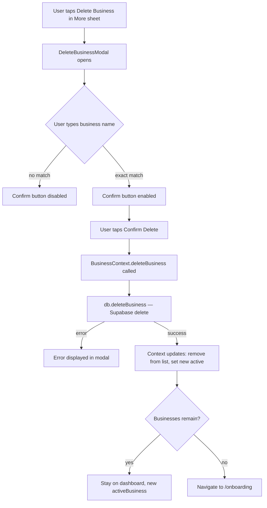

# Design Document: Delete Business

## Overview

The Delete Business feature adds a permanent, irreversible deletion flow for a business and all its associated data. It is triggered from the "More" sheet in the mobile bottom nav and from the sidebar on desktop. The flow uses a two-step confirmation modal — first presenting a warning, then requiring the user to type the exact business name before the destructive action is enabled. After deletion, the app transitions to another available business or redirects to onboarding if none remain.

The design touches four layers:
1. **DB layer** — new `deleteBusiness()` function in `db.ts`
2. **Context layer** — new `deleteBusiness(id)` method in `BusinessContext`
3. **Modal component** — new `DeleteBusinessModal` component
4. **Shell integration** — "Delete Business" entry in the More sheet in `AppShell`

---

## Architecture



The modal owns all UI state (input value, loading, error). The context owns all business state mutations. The DB function owns all Supabase operations.

---

## Components and Interfaces

### DeleteBusinessModal

**Path:** `looplink-landing-page-design-main/src/components/dashboard/DeleteBusinessModal.tsx`

```typescript
interface DeleteBusinessModalProps {
  business: Business;          // the business to be deleted
  onClose: () => void;         // called on cancel or outside tap
  onDeleted: () => void;       // called after successful deletion (context already updated)
}
```

Internal state:
- `inputValue: string` — tracks the name confirmation input
- `isLoading: boolean` — true while deletion is in progress
- `error: string | null` — holds error message on failure

The confirm button is enabled only when `inputValue === business.name` (strict equality, case-sensitive) and `!isLoading`.

Two-step layout:
1. Warning section — title "Delete Business?", permanence message listing transactions, inventory, and records
2. Name confirmation input — labelled prompt, text input, confirm + cancel buttons

### AppShell changes

In the More sheet section, after the "Add New Business" button and before the Logout button, add a "Delete Business" danger button. It is only rendered when `activeBusiness` is not null.

```typescript
// New state in AppShell
const [showDeleteBiz, setShowDeleteBiz] = useState(false);
```

The button opens `DeleteBusinessModal` for `activeBusiness`. On `onDeleted`, close the modal and the More sheet.

### db.ts — deleteBusiness

```typescript
export async function deleteBusiness(businessId: string): Promise<void>
```

Deletion order (explicit, not relying solely on cascade):
1. Delete `inventory_losses` where `business_id = businessId`
2. Delete `inventory_sales` where `business_id = businessId`
3. Delete `inventory_items` where `business_id = businessId`
4. Delete `transactions` where `business_id = businessId`
5. Delete `businesses` where `id = businessId`

Each step throws on error. If any step fails, the function throws and the caller handles the error — no partial cleanup is attempted at the application layer (Supabase FK constraints prevent orphaned child rows from the business delete itself).

### BusinessContext — deleteBusiness method

```typescript
deleteBusiness: (id: string) => Promise<void>
```

Added to `BusinessContextType`. Implementation:
1. Call `db.deleteBusiness(id)` — throws on failure, propagated to caller
2. Compute new list: `businesses.filter(b => b.id !== id)`
3. Compute new active: first remaining business, or `null`
4. Update `localStorage`: set `ll_active_biz` to new active id, or remove key if null
5. `setBusinesses(newList)` and `setActiveBusiness(newActive)` — both set before returning
6. Caller (modal/AppShell) handles navigation after this resolves

---

## Data Models

No new database tables or schema changes are required. The feature operates on existing tables:

| Table | Action |
|---|---|
| `businesses` | DELETE WHERE id = businessId |
| `transactions` | DELETE WHERE business_id = businessId |
| `inventory_items` | DELETE WHERE business_id = businessId |
| `inventory_sales` | DELETE WHERE business_id = businessId |
| `inventory_losses` | DELETE WHERE business_id = businessId |

The `Business` type from `db.ts` is used as-is. No new types are introduced.

localStorage key `ll_active_biz` is updated or removed as part of the context mutation.

---

## Correctness Properties

*A property is a characteristic or behavior that should hold true across all valid executions of a system — essentially, a formal statement about what the system should do. Properties serve as the bridge between human-readable specifications and machine-verifiable correctness guarantees.*

### Property 1: Confirm button enabled iff input exactly matches business name

*For any* business name and any string typed into the confirmation input, the confirm delete button should be enabled if and only if the typed string is strictly equal (case-sensitive) to the business name, and disabled for all other inputs.

**Validates: Requirements 3.2, 3.3, 3.4**

---

### Property 2: Deleted business is absent from DB

*For any* business that exists in the database, after `deleteBusiness(id)` completes successfully, querying the `businesses` table for that id should return no rows.

**Validates: Requirements 4.1, 4.5**

---

### Property 3: Transactions are deleted with the business

*For any* business with any number of associated transactions, after `deleteBusiness(id)` completes successfully, querying `transactions` for that `business_id` should return an empty result set.

**Validates: Requirements 4.2**

---

### Property 4: Inventory records are deleted with the business

*For any* business with any number of associated inventory items, sales, or losses, after `deleteBusiness(id)` completes successfully, querying `inventory_items`, `inventory_sales`, and `inventory_losses` for that `business_id` should each return empty result sets.

**Validates: Requirements 4.3**

---

### Property 5: Active business is updated after deletion

*For any* business list of length ≥ 2, after deleting the currently active business, the `activeBusiness` in context should be one of the remaining businesses (not null, not the deleted one).

**Validates: Requirements 5.1, 5.3, 6.1**

---

### Property 6: Business list does not contain deleted business

*For any* business list, after calling `deleteBusiness(id)`, the `businesses` array in context should not contain any entry with the deleted id.

**Validates: Requirements 5.3, 6.1**

---

## Error Handling

**DB failure during deletion:**
- `deleteBusiness()` in `db.ts` throws the Supabase error
- `BusinessContext.deleteBusiness()` re-throws without mutating state
- `DeleteBusinessModal` catches the error, sets `error` state, re-enables the confirm button, and displays the error message inline
- No partial state change occurs in context or localStorage

**No active business:**
- The "Delete Business" button in the More sheet is only rendered when `activeBusiness !== null`, so the modal is never opened without a valid business

**Navigation after last business deleted:**
- `activeBusiness` is set to `null` and `ll_active_biz` is removed from localStorage before `navigate("/onboarding")` is called
- This prevents any dashboard component from reading a stale active business

**Duplicate submission:**
- While `isLoading` is true, the confirm button is disabled, preventing re-submission

---

## Testing Strategy

### Unit Tests

Focus on specific examples and edge cases:

- Render `DeleteBusinessModal` — confirm title "Delete Business?" is present
- Render `DeleteBusinessModal` — confirm warning message mentions permanence, transactions, inventory
- Confirm button is disabled on initial render (empty input)
- Confirm button is disabled when input is a case-variant of the business name (e.g., `"MY BIZ"` vs `"My Biz"`)
- Confirm button is enabled when input exactly matches business name
- Clicking cancel closes modal without calling delete
- Clicking outside modal closes modal without calling delete
- When `deleteBusiness` throws, error message is displayed and button is re-enabled
- When deletion is in progress (`isLoading = true`), confirm button is disabled
- After successful deletion with remaining businesses, `activeBusiness` is not the deleted one
- After deleting the last business, `navigate("/onboarding")` is called and `activeBusiness` is null

### Property-Based Tests

Use a property-based testing library (e.g., `fast-check` for TypeScript/Vitest).

Each property test should run a minimum of 100 iterations.

Tag format for each test: `Feature: delete-business, Property {N}: {property_text}`

**Property 1 — Confirm button enabled iff input exactly matches**
Generate: random business name strings, random input strings (including case variants, substrings, superstrings, whitespace variants).
Assert: `isEnabled === (input === businessName)`.
`// Feature: delete-business, Property 1: confirm button enabled iff input exactly matches business name`

**Property 2 — Deleted business absent from DB**
Generate: random business records inserted into a test Supabase instance (or mock).
Assert: after `deleteBusiness(id)`, `getBusinesses()` does not include the deleted id.
`// Feature: delete-business, Property 2: deleted business is absent from DB`

**Property 3 — Transactions deleted with business**
Generate: random businesses each with a random number of transactions.
Assert: after `deleteBusiness(id)`, `getTransactions(id)` returns `[]`.
`// Feature: delete-business, Property 3: transactions are deleted with the business`

**Property 4 — Inventory records deleted with business**
Generate: random businesses each with random inventory items, sales, and losses.
Assert: after `deleteBusiness(id)`, all three inventory queries return `[]`.
`// Feature: delete-business, Property 4: inventory records are deleted with the business`

**Property 5 — Active business updated after deletion**
Generate: random arrays of Business objects with length ≥ 2, random index to delete.
Assert: after context `deleteBusiness`, `activeBusiness` is in the remaining list and is not the deleted one.
`// Feature: delete-business, Property 5: active business is updated after deletion`

**Property 6 — Business list does not contain deleted business**
Generate: random arrays of Business objects, random index to delete.
Assert: after context `deleteBusiness`, `businesses` array does not contain the deleted id.
`// Feature: delete-business, Property 6: business list does not contain deleted business`
