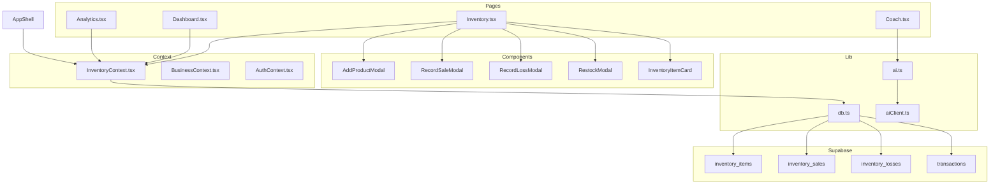

# Design Document — Inventory System Rebuild

## Overview

The Inventory System Rebuild replaces the gated, basic inventory module in LoopLink with a first-class, always-visible inventory system. The rebuild supports three item modes — Product, Bulk, and Service — with real-time stock management, pack/unit dual-tracking, damage/loss recording, and full integration into the Dashboard, Analytics, and AI Insights layers.

The system is built on the existing stack: React + TypeScript + Vite + Tailwind CSS + Supabase + Groq AI (llama-3.3-70b-versatile). It extends the existing `db.ts`, `aiClient.ts`, and `ai.ts` modules and replaces the current `InventoryContext.tsx`, `Inventory.tsx`, `AddItemModal.tsx`, and `RecordSaleModal.tsx`.

Key design goals:
- Remove the `sellsGoods` feature gate entirely — Inventory is always accessible
- Support three item modes with distinct data shapes and business logic
- Implement pack/unit dual-tracking with mathematically correct stock reduction
- Integrate inventory data into Dashboard totals, Analytics breakdowns, and AI context
- Maintain RLS-enforced data isolation per business

---

## Architecture



### Data Flow

1. `InventoryContext` loads all inventory items, sales, and losses for the active business on mount and exposes a `refreshInventory()` function.
2. All modals call `db.ts` functions directly, then call `refreshInventory()` on success.
3. Sale recording also calls `addTransaction()` to log income and profit in the transactions table, ensuring Dashboard totals stay in sync.
4. Loss recording calls `addTransaction()` to log the loss as an expense.
5. AI context is built from `InventoryContext` data and passed to `aiRequest()` / `aiStream()`.

---

## Components and Interfaces

### AppShell Changes

Remove the `sellsGoods` import and conditional from `navItems`. Inventory is always present:

```typescript
const navItems = [
  { path: "/dashboard", icon: LayoutDashboard, label: "Dashboard" },
  { path: "/analytics", icon: BarChart3, label: "Analytics" },
  { path: "/inventory", icon: Package, label: "Inventory" },
  { path: "/coach", icon: Brain, label: "AI Coach" },
  { path: "/chat", icon: MessageSquare, label: "AI Chat" },
  { path: "/history", icon: History, label: "History" },
];
```

### InventoryContext (rebuilt)

```typescript
interface InventoryContextType {
  inventoryItems: InventoryItem[];
  inventorySales: InventorySale[];
  inventoryLosses: InventoryLoss[];
  refreshInventory: () => Promise<void>;
  loading: boolean;
}
```

No `sellsGoods` toggle. Loads data whenever `activeBusiness` changes.

### src/pages/Inventory.tsx

Tabbed layout with four tabs:
- **Overview** — summary cards + item grid
- **Products** — filterable/searchable item list
- **Sales History** — paginated sales log
- **Losses** — paginated loss log

Empty state: when `inventoryItems.length === 0`, renders contextual CTA buttons for each item type.

### src/components/inventory/AddProductModal.tsx

Multi-step modal:
1. **Step 1 — Choose Type**: Product / Bulk / Service cards
2. **Step 2 — Fill Fields**: Dynamic form based on type; for Product with Pack/Bulk purchase type, shows pack fields and live preview label
3. **Step 3 — Preview**: Summary before save

Props:
```typescript
interface AddProductModalProps {
  open: boolean;
  onClose: () => void;
  onSuccess: () => void;
  businessId: string;
}
```

### src/components/inventory/RecordSaleModal.tsx

```typescript
interface RecordSaleModalProps {
  open: boolean;
  onClose: () => void;
  onSuccess: () => void;
  businessId: string;
  items: InventoryItem[];
}
```

Features:
- Searchable combobox for item selection (debounced, 300ms)
- Auto-fills selling price on item select
- For pack items: sale mode toggle (Full Pack / Individual Units)
- Profit preview before save
- Manual entry fallback when no item selected

### src/components/inventory/RecordLossModal.tsx

```typescript
interface RecordLossModalProps {
  open: boolean;
  onClose: () => void;
  onSuccess: () => void;
  businessId: string;
  items: InventoryItem[];
}
```

Fields: item picker, quantity lost, optional reason (text input).

### src/components/inventory/RestockModal.tsx

```typescript
interface RestockModalProps {
  open: boolean;
  onClose: () => void;
  onSuccess: () => void;
  businessId: string;
  items: InventoryItem[];
}
```

Fields: item picker, quantity to add.

### src/components/inventory/InventoryItemCard.tsx

```typescript
interface InventoryItemCardProps {
  item: InventoryItem;
  onSale: () => void;
  onLoss: () => void;
  onRestock: () => void;
}
```

Displays: name, type badge, stock display (formatted per type), status badge (In Stock / Low Stock / Out of Stock), action buttons.

---

## Data Models

### TypeScript Types (db.ts additions)

```typescript
export type ItemType = "product" | "bulk" | "service";
export type PurchaseType = "single" | "pack";
export type SaleMode = "pack" | "unit";
export type StockStatus = "in_stock" | "low_stock" | "out_of_stock";

export interface InventoryItem {
  id: string;
  business_id: string;
  user_id: string;
  name: string;
  item_type: ItemType;
  quantity: number | null;           // null for service
  unit_type: string | null;          // for bulk items
  cost_price: number | null;
  selling_price: number;
  category: string | null;
  low_stock_threshold: number | null; // default 5
  status: StockStatus | null;        // null for service
  purchase_type: PurchaseType | null;
  units_per_pack: number | null;
  pack_cost: number | null;
  unit_name: string | null;
  pack_name: string | null;
  unit_selling_price: number | null;
  pack_selling_price: number | null;
  created_at: string;
  updated_at: string;
}

export interface InventorySale {
  id: string;
  item_id: string | null;            // null for manual sales
  business_id: string;
  user_id: string;
  quantity_sold: number;
  sale_price_per_unit: number;
  profit: number | null;
  item_type: ItemType | null;
  sale_mode: SaleMode | null;
  units_sold: number | null;
  packs_sold: number | null;
  created_at: string;
}

export interface InventoryLoss {
  id: string;
  item_id: string;
  business_id: string;
  user_id: string;
  quantity_lost: number;
  reason: string | null;
  created_at: string;
}
```

### Stock Display Logic

```typescript
// Pure function — no side effects
export function formatStockDisplay(item: InventoryItem): string {
  if (item.item_type === "service") return "Service";
  if (item.purchase_type === "pack" && item.units_per_pack) {
    const totalUnits = item.quantity ?? 0;
    const packs = Math.floor(totalUnits / item.units_per_pack);
    const looseUnits = totalUnits % item.units_per_pack;
    const packName = item.pack_name ?? "packs";
    const unitName = item.unit_name ?? "units";
    if (packs > 0 && looseUnits > 0) return `${packs} ${packName} + ${looseUnits} ${unitName} remaining`;
    if (packs > 0) return `${packs} ${packName} remaining`;
    return `${looseUnits} ${unitName} remaining`;
  }
  const unit = item.unit_type ?? "units";
  return `${item.quantity ?? 0} ${unit}`;
}

// Pure function — derives status from quantity and threshold
export function deriveStockStatus(item: InventoryItem): StockStatus | null {
  if (item.item_type === "service") return null;
  const qty = item.quantity ?? 0;
  const threshold = item.low_stock_threshold ?? 5;
  if (qty <= 0) return "out_of_stock";
  if (qty <= threshold) return "low_stock";
  return "in_stock";
}
```

### Pack/Unit Math

```typescript
// Total units stored in quantity column for pack items
// packs = floor(quantity / units_per_pack)
// loose_units = quantity % units_per_pack

export function calcPackSaleStockReduction(
  currentUnits: number,
  packsSold: number,
  unitsPerPack: number
): number {
  return packsSold * unitsPerPack; // reduce total units by this amount
}

export function calcUnitSaleStockReduction(unitsSold: number): number {
  return unitsSold;
}

export function calcPackSaleProfit(
  packsSold: number,
  packSellingPrice: number,
  packCost: number
): number {
  return packsSold * (packSellingPrice - packCost);
}

export function calcUnitSaleProfit(
  unitsSold: number,
  unitSellingPrice: number,
  costPerUnit: number
): number {
  return unitsSold * (unitSellingPrice - costPerUnit);
}

export function calcCostPerUnit(packCost: number, unitsPerPack: number): number {
  return packCost / unitsPerPack;
}
```

---

## Database Schema

### inventory_items — ALTER/REBUILD

```sql
-- Add new columns to existing inventory_items table
ALTER TABLE inventory_items
  ADD COLUMN IF NOT EXISTS item_type TEXT NOT NULL DEFAULT 'product'
    CHECK (item_type IN ('product', 'bulk', 'service')),
  ADD COLUMN IF NOT EXISTS unit_type TEXT,
  ADD COLUMN IF NOT EXISTS category TEXT,
  ADD COLUMN IF NOT EXISTS low_stock_threshold INTEGER DEFAULT 5,
  ADD COLUMN IF NOT EXISTS status TEXT DEFAULT 'in_stock'
    CHECK (status IN ('in_stock', 'low_stock', 'out_of_stock')),
  ADD COLUMN IF NOT EXISTS purchase_type TEXT DEFAULT 'single'
    CHECK (purchase_type IN ('single', 'pack')),
  ADD COLUMN IF NOT EXISTS units_per_pack INTEGER,
  ADD COLUMN IF NOT EXISTS pack_cost NUMERIC(12, 2),
  ADD COLUMN IF NOT EXISTS unit_name TEXT,
  ADD COLUMN IF NOT EXISTS pack_name TEXT,
  ADD COLUMN IF NOT EXISTS unit_selling_price NUMERIC(12, 2),
  ADD COLUMN IF NOT EXISTS pack_selling_price NUMERIC(12, 2),
  ADD COLUMN IF NOT EXISTS updated_at TIMESTAMPTZ DEFAULT NOW();

-- Constraint: pack items must have units_per_pack > 0
ALTER TABLE inventory_items
  ADD CONSTRAINT chk_pack_units
    CHECK (purchase_type != 'pack' OR (units_per_pack IS NOT NULL AND units_per_pack > 0));

-- Auto-update updated_at
CREATE OR REPLACE FUNCTION update_inventory_updated_at()
RETURNS TRIGGER AS $$
BEGIN
  NEW.updated_at = NOW();
  RETURN NEW;
END;
$$ LANGUAGE plpgsql;

CREATE TRIGGER inventory_items_updated_at
  BEFORE UPDATE ON inventory_items
  FOR EACH ROW EXECUTE FUNCTION update_inventory_updated_at();

-- RLS (ensure existing policies cover new columns — re-enable if needed)
ALTER TABLE inventory_items ENABLE ROW LEVEL SECURITY;

CREATE POLICY IF NOT EXISTS "inventory_items_user_policy"
  ON inventory_items
  FOR ALL
  USING (user_id = auth.uid() OR business_id IN (
    SELECT id FROM businesses WHERE user_id = auth.uid()
  ));
```

### inventory_losses — CREATE

```sql
CREATE TABLE IF NOT EXISTS inventory_losses (
  id UUID PRIMARY KEY DEFAULT gen_random_uuid(),
  item_id UUID NOT NULL REFERENCES inventory_items(id) ON DELETE RESTRICT,
  business_id UUID NOT NULL,
  user_id UUID NOT NULL,
  quantity_lost NUMERIC(12, 2) NOT NULL CHECK (quantity_lost > 0),
  reason TEXT,
  created_at TIMESTAMPTZ DEFAULT NOW()
);

ALTER TABLE inventory_losses ENABLE ROW LEVEL SECURITY;

CREATE POLICY "inventory_losses_user_policy"
  ON inventory_losses
  FOR ALL
  USING (user_id = auth.uid() OR business_id IN (
    SELECT id FROM businesses WHERE user_id = auth.uid()
  ));
```

### inventory_sales — ALTER

```sql
ALTER TABLE inventory_sales
  ADD COLUMN IF NOT EXISTS profit NUMERIC(12, 2),
  ADD COLUMN IF NOT EXISTS item_type TEXT
    CHECK (item_type IN ('product', 'bulk', 'service')),
  ADD COLUMN IF NOT EXISTS sale_mode TEXT
    CHECK (sale_mode IN ('pack', 'unit')),
  ADD COLUMN IF NOT EXISTS units_sold INTEGER,
  ADD COLUMN IF NOT EXISTS packs_sold INTEGER;

-- Allow null item_id for manual sales
ALTER TABLE inventory_sales
  ALTER COLUMN item_id DROP NOT NULL;

ALTER TABLE inventory_sales ENABLE ROW LEVEL SECURITY;

CREATE POLICY IF NOT EXISTS "inventory_sales_user_policy"
  ON inventory_sales
  FOR ALL
  USING (user_id = auth.uid() OR business_id IN (
    SELECT id FROM businesses WHERE user_id = auth.uid()
  ));
```

---

## Function Signatures (db.ts additions)

```typescript
// ── New inventory item creation (replaces old addInventoryItem) ───────────────

export interface AddInventoryItemParams {
  businessId: string;
  name: string;
  itemType: ItemType;
  quantity?: number;
  unitType?: string;
  costPrice?: number;
  sellingPrice: number;
  category?: string;
  lowStockThreshold?: number;
  purchaseType?: PurchaseType;
  unitsPerPack?: number;
  packCost?: number;
  unitName?: string;
  packName?: string;
  unitSellingPrice?: number;
  packSellingPrice?: number;
}

export async function addInventoryItemV2(params: AddInventoryItemParams): Promise<InventoryItem>

// ── Sale recording with pack/unit logic ───────────────────────────────────────

export interface RecordSaleParams {
  itemId: string | null;       // null for manual sales
  businessId: string;
  quantitySold: number;
  salePricePerUnit: number;
  profit?: number;
  itemType?: ItemType;
  saleMode?: SaleMode;
  unitsSold?: number;
  packsSold?: number;
}

export async function recordInventorySaleV2(params: RecordSaleParams): Promise<InventorySale>
// Also calls addTransaction() internally to log income + profit

// ── Loss recording ────────────────────────────────────────────────────────────

export async function addInventoryLoss(
  itemId: string,
  businessId: string,
  quantityLost: number,
  reason?: string
): Promise<InventoryLoss>
// Also calls addTransaction() internally to log as expense

// ── Losses query ──────────────────────────────────────────────────────────────

export async function getInventoryLosses(businessId: string): Promise<InventoryLoss[]>

// ── Item with sales (for analytics) ──────────────────────────────────────────

export interface InventoryItemWithSales extends InventoryItem {
  totalUnitsSold: number;
  totalRevenue: number;
  totalProfit: number;
  lastSaleDate: string | null;
}

export async function getInventoryItemWithSales(
  itemId: string
): Promise<InventoryItemWithSales>
```

---

## AI Integration

### Updated InventoryContextItem (aiClient.ts)

```typescript
export interface InventoryContextItem {
  name: string;
  itemType: ItemType;
  quantity: number | null;
  costPrice: number | null;
  sellingPrice: number;
  totalUnitsSold: number;
  totalLosses: number;
  isDeadStock: boolean;        // no sale in past 30 days
  isLowStock: boolean;
  status: StockStatus | null;
}
```

### AI Context Building

The `buildContextMessage` function in `aiClient.ts` is extended to include richer inventory context:

```typescript
if (payload.inventoryContext?.items?.length) {
  const lines = payload.inventoryContext.items.map(item => {
    const stockInfo = item.quantity !== null ? `${item.quantity} in stock` : "service";
    const flags = [
      item.isLowStock ? "LOW STOCK" : null,
      item.isDeadStock ? "DEAD STOCK" : null,
      item.totalLosses > 3 ? `${item.totalLosses} losses` : null,
    ].filter(Boolean).join(", ");
    return `  - ${item.name} (${item.itemType}): ${stockInfo} | Sell ₦${item.sellingPrice.toLocaleString()} | ${item.totalUnitsSold} sold${flags ? ` | ⚠ ${flags}` : ""}`;
  }).join("\n");
  parts.push(`[Inventory Context]\n${lines}`);
}
```

### Health Score Integration (ai.ts)

`calcHealthScore` is extended to accept optional inventory metrics:

```typescript
export interface InventoryMetrics {
  deadStockCount: number;
  highLossItemCount: number;  // items with >3 losses in 30 days
  outOfStockCount: number;
}

export function calcHealthScore(
  transactions: Transaction[],
  inventoryMetrics?: InventoryMetrics
): HealthScore {
  // ... existing logic ...
  // Inventory penalties:
  if (inventoryMetrics) {
    score -= inventoryMetrics.deadStockCount * 2;       // -2 per dead stock item
    score -= inventoryMetrics.highLossItemCount * 5;    // -5 per recurring loss item
    score -= Math.min(inventoryMetrics.outOfStockCount * 3, 15); // -3 per OOS, max -15
  }
  score = Math.max(0, Math.min(100, score));
  // ... label assignment ...
}
```

---

## Analytics Integration (Analytics.tsx)

New inventory section added to the Analytics page with three sub-sections:

1. **Best-Selling Products** — bar chart ranked by `totalUnitsSold` descending, filtered by selected time period
2. **Dead Stock** — list of items with no sale in the past 30 days, showing estimated tied-up capital (quantity × cost_price)
3. **Inventory Value** — metric card showing current total stock value

Data is derived from `InventoryContext` + a `getInventoryItemWithSales` call per item (or a single aggregated query).

---

## Error Handling

| Scenario | Handling |
|---|---|
| Sale would reduce stock below zero | Reject before DB call; show inline error "Insufficient stock" |
| Pack sale with units_per_pack = 0 | DB constraint + client-side guard; show "Invalid pack configuration" |
| Loss quantity > current stock | Warn user but allow (stock can go to 0, not negative) |
| Supabase RLS rejection | Catch error, show toast "Permission denied" |
| Network failure during sale | Show toast "Sale failed — please try again"; do not update local state |
| Missing required fields | Inline validation errors adjacent to fields; do not clear valid inputs |
| AI context build failure | Silently omit inventory context; AI still responds with transaction data |
| item_id FK violation in losses | DB constraint catches it; surface as "Item not found" error |

---

## Testing Strategy

### Dual Testing Approach

Both unit tests and property-based tests are required. Unit tests cover specific examples, integration points, and edge cases. Property-based tests verify universal correctness across all valid inputs.

**Property-Based Testing Library**: `fast-check` (TypeScript-native, works with Vitest)

Install: `npm install --save-dev fast-check`

**Configuration**: Each property test runs a minimum of 100 iterations via `fc.assert(fc.property(...), { numRuns: 100 })`.

**Tag format**: Each property test includes a comment:
`// Feature: inventory-system-rebuild, Property N: <property_text>`

### Unit Test Coverage

- `formatStockDisplay()` — specific examples for each item type and pack/unit combination
- `deriveStockStatus()` — boundary values (0, threshold, threshold+1)
- `calcHealthScore()` — with and without inventory metrics
- `AddProductModal` — renders correct fields per item type
- `RecordSaleModal` — pre-fills price on item select, shows profit preview
- `InventoryItemCard` — renders correct status badge per status value
- Empty state rendering in `Inventory.tsx`
- `Inventory.tsx` tabs render correct content

### Property Test Coverage

Each property below maps to a test in `src/test/inventory.property.test.ts`.


---

## Correctness Properties

*A property is a characteristic or behavior that should hold true across all valid executions of a system — essentially, a formal statement about what the system should do. Properties serve as the bridge between human-readable specifications and machine-verifiable correctness guarantees.*

---

### Property 1: Stock Status Assignment

*For any* inventory item (product or bulk) with a given quantity and low_stock_threshold, the derived status must satisfy exactly one of: `out_of_stock` when quantity ≤ 0, `low_stock` when 0 < quantity ≤ threshold, or `in_stock` when quantity > threshold. No other status value is valid, and the three cases are mutually exclusive and exhaustive.

**Validates: Requirements 2.2, 2.3, 2.4, 3.4, 5.4, 5.5**

---

### Property 2: Stock Reduction Invariant

*For any* inventory item with a current stock quantity Q, recording a sale or loss of quantity N (where N ≤ Q) must result in a new stock quantity of exactly Q − N. The reduction must be atomic — no intermediate state should be observable.

**Validates: Requirements 3.3, 5.1, 5.2, 6.3, 7.3**

---

### Property 3: Restock Round Trip

*For any* inventory item with stock quantity Q, recording a loss of N units followed immediately by a restock of N units must return the stock to exactly Q. This round-trip property holds for all valid N ≤ Q.

**Validates: Requirements 5.3, 7.6**

---

### Property 4: Oversell Prevention

*For any* inventory item with stock quantity Q, any sale or loss attempt with quantity N > Q must be rejected and the stock quantity must remain unchanged at Q.

**Validates: Requirements 3.5, 15.8**

---

### Property 5: Pack/Unit Total Units Invariant

*For any* pack-type inventory item with `units_per_pack` = U and a total unit count of T, the displayed pack count must equal `floor(T / U)` and the displayed loose unit count must equal `T % U`. The displayed pack count must never be negative.

**Validates: Requirements 15.4, 15.9, 15.10**

---

### Property 6: Pack Sale Stock Reduction

*For any* pack-type item with `units_per_pack` = U and total units T, recording a full-pack sale of P packs must reduce total units by exactly P × U. The resulting total units must be T − (P × U).

**Validates: Requirements 15.6**

---

### Property 7: Unit Sale Stock Reduction

*For any* pack-type item with total units T, recording a unit sale of N individual units must reduce total units by exactly N. The resulting pack count must be `floor((T − N) / units_per_pack)`.

**Validates: Requirements 15.7**

---

### Property 8: Profit Calculation Correctness

*For any* sale record, the stored profit value must equal:
- For pack sales: `packs_sold × (pack_selling_price − pack_cost)`
- For unit sales: `units_sold × (unit_selling_price − cost_per_unit)` where `cost_per_unit = pack_cost / units_per_pack`
- For simple product/bulk/service sales: `quantity_sold × (selling_price − cost_price)`

No sale record may have a profit value that deviates from these formulas.

**Validates: Requirements 6.4, 15.11, 15.12**

---

### Property 9: Cost Per Unit Derivation

*For any* pack-type item with `pack_cost` = C and `units_per_pack` = U (where U > 0), the derived `cost_per_unit` must equal exactly C / U. This value must be consistent across all profit calculations for that item.

**Validates: Requirements 15.3**

---

### Property 10: Low Stock Threshold Applies to Total Units

*For any* pack-type item, the stock status must be derived from the total unit count (quantity), not the pack count. An item with 2 packs of 12 units each (24 total units) and a threshold of 10 must have status `in_stock`, not `low_stock`.

**Validates: Requirements 15.13**

---

### Property 11: Total Stock Value Calculation

*For any* set of product and bulk inventory items, the computed total stock value must equal the sum of `(quantity × cost_price)` for each item. Service items must contribute zero to this total. The calculation must be consistent regardless of item ordering.

**Validates: Requirements 8.2, 9.6**

---

### Property 12: Dead Stock Detection

*For any* inventory item, if no sale record exists for that item within the past 30 days, the item must be classified as dead stock. If at least one sale record exists within the past 30 days, the item must not be classified as dead stock.

**Validates: Requirements 9.5, 10.2**

---

### Property 13: Best-Selling Products Ordering

*For any* set of inventory items with associated sale records, the best-selling products list must be ordered by total units sold in descending order. No item with fewer total units sold may appear before an item with more total units sold.

**Validates: Requirements 9.4**

---

### Property 14: Recurring Loss Detection

*For any* inventory item, if the count of loss records within a 30-day window exceeds 3, the item must be flagged for recurring loss investigation. Items with 3 or fewer loss records in the same window must not be flagged.

**Validates: Requirements 10.5**

---

### Property 15: Service Items Have No Stock

*For any* inventory item with `item_type = 'service'`, the quantity field must be null and the status field must be null. No stock-related operations (stock reduction, low stock threshold checks) may apply to service items.

**Validates: Requirements 4.2, 11.4**

---

### Property 16: Required Field Validation

*For any* item creation attempt, the system must reject the attempt if any required field for the given item type is missing or invalid:
- Product: name, quantity, cost_price, selling_price, category
- Bulk: name, quantity, unit_type
- Service: name, selling_price
- Pack/Bulk purchase type additionally requires: units_per_pack > 0, pack_cost, pack_name, unit_name

**Validates: Requirements 2.1, 3.1, 4.1, 15.2**

---

### Property 17: Health Score Inventory Penalty

*For any* set of transactions and inventory metrics, the health score with dead stock items or recurring loss items must be strictly less than or equal to the health score computed without those penalties. Adding more dead stock or loss items must never increase the health score.

**Validates: Requirements 10.6**
