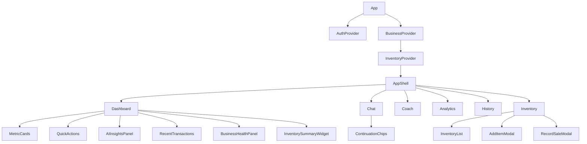
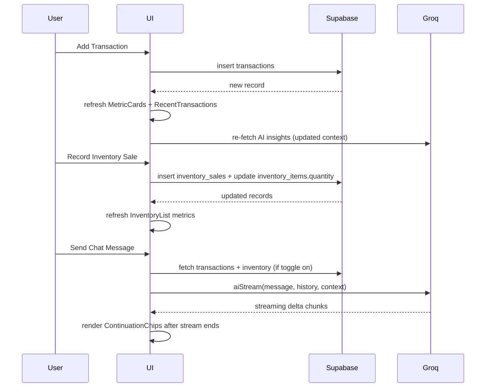
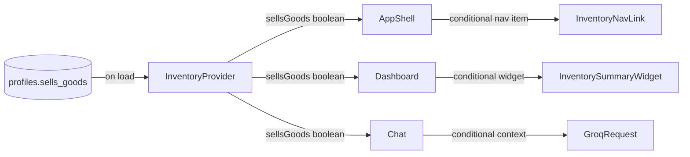

# Design Document — LoopLink Platform Upgrade

## Overview

This upgrade transforms LoopLink from a functional MVP into a polished, premium-feeling SaaS product. The changes span five areas: landing page restructure, dashboard redesign, AI experience upgrade, a new inventory/goods management module, and full real-time data integration. All work is additive or modifying existing files — no architectural rewrites are needed.

The tech stack remains React + TypeScript + Vite + Tailwind CSS + Supabase + Groq AI (llama-3.3-70b-versatile). The existing context/provider pattern, Supabase query layer, and streaming AI client are all preserved and extended.

---

## Architecture

### High-Level Component Map



### Data Flow



### Sells_Goods_Toggle State Propagation



---

## Components and Interfaces

### Files Modified

| File | Change |
|---|---|
| `src/components/landing/Navbar.tsx` | Remove "Features" + "How It Works" links; keep Logo, Login, Get Started |
| `src/components/landing/Footer.tsx` | Add FAQ, How It Works, Contact, Terms links |
| `src/components/dashboard/AppShell.tsx` | Add conditional Inventory nav item driven by `sellsGoods` prop |
| `src/pages/Dashboard.tsx` | Elevated MetricCards, 2-col grid, redesigned QuickActions, InventorySummaryWidget |
| `src/pages/Chat.tsx` | Add ContinuationChips after each completed assistant response; add inventory context |
| `src/lib/db.ts` | Add inventory types + 4 new query functions |
| `src/lib/aiClient.ts` | Extend `AIRequestPayload` with `inventoryContext`; include in `buildContextMessage` |
| `src/context/BusinessContext.tsx` | No change — kept as-is |
| `src/App.tsx` | Add `/inventory` route; wrap with `InventoryProvider` |

### Files Created

| File | Purpose |
|---|---|
| `src/context/InventoryContext.tsx` | Manages `sellsGoods` toggle state + inventory data |
| `src/pages/Inventory.tsx` | Full inventory management page |
| `src/components/dashboard/AddItemModal.tsx` | Modal for creating a new inventory item |
| `src/components/dashboard/RecordSaleModal.tsx` | Modal for recording a sale against an item |

---

### Navbar.tsx — Changes

Remove the `["Features", "How It Works"]` link arrays from both desktop and mobile menus. Keep only:
- LoopLink logo (left)
- "Login" button → `/login`
- "Get Started Free" button → `/signup`

The scroll-based glass-morphism logic (`scrolled` state + `window.scrollY > 20`) is already implemented and stays unchanged.

---

### Footer.tsx — Changes

Add a dedicated "Links" column (or extend the existing "Product" column) with:
- FAQ → `/faq`
- How It Works → `/#how-it-works` (hash scroll)
- Contact → `mailto:hello@looplink.app`
- Terms → `#` (placeholder until Terms page exists)

The copyright notice and brand name are already present and stay unchanged.

---

### AppShell.tsx — Changes

Accept a new `sellsGoods: boolean` prop. Conditionally include the Inventory nav item:

```tsx
const getNavItems = (sellsGoods: boolean) => [
  { path: "/dashboard", icon: LayoutDashboard, label: "Dashboard" },
  { path: "/analytics", icon: BarChart3, label: "Analytics" },
  { path: "/coach", icon: Brain, label: "AI Coach" },
  { path: "/chat", icon: MessageSquare, label: "AI Chat" },
  { path: "/history", icon: History, label: "History" },
  ...(sellsGoods ? [{ path: "/inventory", icon: Package, label: "Inventory" }] : []),
];
```

The `sellsGoods` value is read from `InventoryContext` inside each page that renders `AppShell`, so no prop drilling through multiple layers is needed — each page calls `useInventory()` and passes `sellsGoods` down.

---

### Dashboard.tsx — Changes

**MetricCards**: Add `box-shadow` via Tailwind `shadow-md` or `shadow-lg` to each card. The existing 2-col mobile / 4-col desktop grid is already correct. Each card gets a larger icon container (`w-10 h-10`) and the numeric value uses `font-display text-2xl`.

**Two-column grid**: Change the existing `lg:grid-cols-3` layout to an explicit `lg:grid-cols-3` where left = `lg:col-span-2` (AI Insights + Recent Transactions) and right = `lg:col-span-1` (Business Health + Quick Actions). This matches the current structure — the main change is ensuring the grid is explicit and documented.

**QuickActions**: Replace the current `Button` list with card-style divs:

```tsx
const quickActions = [
  { label: "Add Income", icon: ArrowUpRight, color: "emerald", action: () => openModal("income") },
  { label: "Add Expense", icon: ArrowDownRight, color: "red", action: () => openModal("expense") },
  { label: "View Analytics", icon: BarChart3, color: "blue", action: () => navigate("/analytics") },
  { label: "AI Chat", icon: MessageSquare, color: "purple", action: () => navigate("/chat") },
];
```

Each card: `rounded-2xl border bg-card p-4 flex items-center gap-3 cursor-pointer hover:bg-muted/60 hover:scale-[1.02] transition-all`.

**InventorySummaryWidget**: Conditionally rendered when `sellsGoods` is true. Shows total items, total stock value (sum of `quantity × cost_price`), and a "View Inventory" link.

---

### Chat.tsx — Changes

**ContinuationChips**: After each completed assistant message (i.e., `streaming === false` and the last message is `role: "assistant"` with non-empty content), render 2–4 chip buttons below the message bubble.

The chips are generated by a second, lightweight non-streaming AI call (`aiRequest`) immediately after the stream completes. The request asks the model to return a JSON array of 2–4 short follow-up suggestions based on the assistant's last response. A fallback set of static chips is used if the AI call fails.

```tsx
// Chip generation prompt
const CHIP_PROMPT = `Based on your last response, suggest 2-4 short follow-up questions or actions the user might want to take next. Return ONLY a JSON array of strings, max 8 words each. Always include at least one of: "Give step-by-step plan", "Analyze your performance", "Suggest business ideas".`;
```

Chips are stored per-message index in a `Map<number, string[]>` state. When a user clicks a chip, it calls `sendMessage(chipText)`.

**Inventory context**: When `sellsGoods` is true, fetch inventory items and pass them to `aiStream` via the new `inventoryContext` field on `AIRequestPayload`.

**Conversation history**: The existing `messages` state already serves as history. The `aiStream` call already passes `messages` (history before the new message) as the second argument. Session persistence is added via `sessionStorage` — on mount, restore from `sessionStorage.getItem("ll_chat_history")`; on each message update, write back.

---

### InventoryContext.tsx — New File

```tsx
interface InventoryContextType {
  sellsGoods: boolean;
  setSellsGoods: (v: boolean) => void;  // persists to Supabase + localStorage
  inventoryItems: InventoryItem[];
  refreshInventory: () => Promise<void>;
  loading: boolean;
}
```

On mount: read `sellsGoods` from `profiles` table (column `sells_goods boolean default false`). If not found, default to `false`. Also read from `localStorage` as an optimistic cache to avoid flash.

When `setSellsGoods` is called: update `localStorage` immediately (optimistic), then `upsert` to `profiles` table.

---

### Inventory.tsx — New Page

Layout (inside AppShell):
1. Header: "Inventory" title + "Add Item" button
2. Stats row: Total Items, Total Stock Value, Total Units Sold, Total Profit from Sales
3. Item list table/cards: name, quantity, cost price, selling price, profit/unit, actions (Add Stock, Record Sale)
4. Empty state when no items exist

Uses `useInventory()` for data. Opens `AddItemModal` or `RecordSaleModal` as needed.

---

### AddItemModal.tsx — New Component

Form fields:
- Item name (text, required)
- Initial quantity (number, integer ≥ 1, required)
- Cost price per unit (number, decimal ≥ 0, required)
- Selling price per unit (number, decimal ≥ 0, required)

On submit: calls `addInventoryItem(businessId, name, quantity, costPrice, sellingPrice)`. Field-level validation errors shown inline.

---

### RecordSaleModal.tsx — New Component

Form fields:
- Quantity sold (number, integer ≥ 1, required)
- Sale price per unit (pre-filled with item's `selling_price`, editable)

Validates: `quantity_sold ≤ item.quantity`. On submit: calls `recordInventorySale(itemId, businessId, quantitySold, salePricePerUnit)`.

---

## Data Models

### Supabase Schema — New Tables

```sql
-- inventory_items
CREATE TABLE inventory_items (
  id            uuid PRIMARY KEY DEFAULT gen_random_uuid(),
  business_id   uuid NOT NULL REFERENCES businesses(id) ON DELETE CASCADE,
  user_id       uuid NOT NULL REFERENCES auth.users(id) ON DELETE CASCADE,
  name          text NOT NULL,
  quantity      integer NOT NULL DEFAULT 0,
  cost_price    numeric NOT NULL,
  selling_price numeric NOT NULL,
  created_at    timestamptz NOT NULL DEFAULT now()
);

ALTER TABLE inventory_items ENABLE ROW LEVEL SECURITY;

CREATE POLICY "Users manage own inventory items"
  ON inventory_items
  FOR ALL
  USING (auth.uid() = user_id)
  WITH CHECK (auth.uid() = user_id);

-- inventory_sales
CREATE TABLE inventory_sales (
  id                  uuid PRIMARY KEY DEFAULT gen_random_uuid(),
  item_id             uuid NOT NULL REFERENCES inventory_items(id) ON DELETE CASCADE,
  business_id         uuid NOT NULL REFERENCES businesses(id) ON DELETE CASCADE,
  user_id             uuid NOT NULL REFERENCES auth.users(id) ON DELETE CASCADE,
  quantity_sold       integer NOT NULL,
  sale_price_per_unit numeric NOT NULL,
  created_at          timestamptz NOT NULL DEFAULT now()
);

ALTER TABLE inventory_sales ENABLE ROW LEVEL SECURITY;

CREATE POLICY "Users manage own inventory sales"
  ON inventory_sales
  FOR ALL
  USING (auth.uid() = user_id)
  WITH CHECK (auth.uid() = user_id);
```

### Supabase Schema — Profile Extension

```sql
-- Add sells_goods to profiles (or businesses) table
ALTER TABLE profiles ADD COLUMN IF NOT EXISTS sells_goods boolean NOT NULL DEFAULT false;
```

> Note: If a `profiles` table does not exist, `sells_goods` can be added to the `businesses` table instead, scoped per-business. The design assumes a `profiles` table keyed on `auth.users.id`. If absent, the implementation task should create it or use `businesses`.

### TypeScript Types (db.ts additions)

```ts
export interface InventoryItem {
  id: string;
  business_id: string;
  user_id: string;
  name: string;
  quantity: number;       // current stock
  cost_price: number;
  selling_price: number;
  created_at: string;
}

export interface InventorySale {
  id: string;
  item_id: string;
  business_id: string;
  user_id: string;
  quantity_sold: number;
  sale_price_per_unit: number;
  created_at: string;
}
```

### New db.ts Functions

```ts
// Fetch all inventory items for a business
getInventoryItems(businessId: string): Promise<InventoryItem[]>

// Insert a new inventory item
addInventoryItem(
  businessId: string,
  name: string,
  quantity: number,
  costPrice: number,
  sellingPrice: number
): Promise<InventoryItem>

// Insert a sale record AND decrement item quantity in a single transaction
// Uses Supabase RPC or two sequential writes with optimistic UI
recordInventorySale(
  itemId: string,
  businessId: string,
  quantitySold: number,
  salePricePerUnit: number
): Promise<InventorySale>

// Increment stock quantity for an existing item
updateInventoryStock(itemId: string, additionalQuantity: number): Promise<InventoryItem>
```

`recordInventorySale` performs two writes:
1. `INSERT INTO inventory_sales ...`
2. `UPDATE inventory_items SET quantity = quantity - quantitySold WHERE id = itemId`

These are done sequentially. If the sale insert succeeds but the stock update fails, the UI shows an error and the sale record should be rolled back. A Supabase RPC (stored procedure) is the cleanest approach for atomicity — the implementation task should create one.

### AIRequestPayload Extension (aiClient.ts)

```ts
export interface InventoryContext {
  items: Array<{
    name: string;
    quantity: number;
    costPrice: number;
    sellingPrice: number;
    totalUnitsSold: number;
  }>;
}

export interface AIRequestPayload {
  // ... existing fields ...
  inventoryContext?: InventoryContext;
}
```

`buildContextMessage` appends an inventory section when `inventoryContext` is present:

```
[Inventory Context]
- Widget Stand: 12 in stock | Cost ₦500 | Sell ₦800 | 45 units sold
- Phone Case: 3 in stock (LOW) | Cost ₦200 | Sell ₦350 | 120 units sold
```

Items with `quantity ≤ 5` are flagged as `(LOW)` to prompt the AI to surface low-stock warnings.

---

## Correctness Properties


*A property is a characteristic or behavior that should hold true across all valid executions of a system — essentially, a formal statement about what the system should do. Properties serve as the bridge between human-readable specifications and machine-verifiable correctness guarantees.*

### Property 1: Navbar scroll state

*For any* scroll position, if `window.scrollY > 20` then the Navbar element should have the glass-morphism CSS classes applied; if `window.scrollY ≤ 20` then those classes should be absent.

**Validates: Requirements 1.5, 1.6**

---

### Property 2: Hero content word count constraints

*For any* rendered Hero section, the headline text should contain no more than 12 words and the sub-headline text should contain no more than 25 words.

**Validates: Requirements 2.2, 2.3**

---

### Property 3: MetricCard values match transaction aggregates

*For any* list of transactions, the rendered MetricCards should display: Total Income = sum of all income transactions, Total Expenses = sum of all expense transactions, Net Profit = income − expenses, and Profit Margin = (profit / income) × 100 rounded to one decimal place (or 0 when income = 0).

**Validates: Requirements 4.2, 4.3, 4.4, 4.5**

---

### Property 4: QuickActions cards all have icons

*For any* rendered QuickActions panel, every action card should contain at least one icon element alongside its label text.

**Validates: Requirements 6.2**

---

### Property 5: Continuation chips count and required category

*For any* completed assistant message (streaming = false, content non-empty), the rendered chip set should contain between 2 and 4 chips, and at least one chip text should match one of: "Give step-by-step plan", "Analyze your performance", or "Suggest business ideas".

**Validates: Requirements 7.1, 7.5**

---

### Property 6: Chip click sends chip text as user message

*For any* chip with text T, clicking that chip should result in a new user message being appended to the conversation with content exactly equal to T.

**Validates: Requirements 7.3**

---

### Property 7: Chips hidden during streaming

*For any* assistant message that is currently streaming (content may be empty or partial), no continuation chips should be rendered for that message.

**Validates: Requirements 7.4**

---

### Property 8: Financial context always included in AI requests

*For any* AI request sent from AI_Chat or AI_Coach, the request payload should contain: `businessName`, `businessType`, `totalIncome`, `totalExpenses`, `profit`, and `transactions` (up to 20 most recent).

**Validates: Requirements 8.1, 8.2, 8.3**

---

### Property 9: Inventory context included when toggle is on

*For any* AI request sent when `sellsGoods = true` and inventory items exist, the request payload should contain an `inventoryContext` field with the current stock levels, cost prices, selling prices, and total units sold for each item.

**Validates: Requirements 8.4, 13.1**

---

### Property 10: Conversation history capped at 10 messages

*For any* conversation of N messages, the `history` array passed to `aiStream` should have length `min(N, 10)`.

**Validates: Requirements 9.1**

---

### Property 11: Chat session persistence round-trip

*For any* conversation history H written to `sessionStorage`, reading it back (simulating navigation away and return) should produce a history equal to H.

**Validates: Requirements 9.3, 9.4**

---

### Property 12: Inventory nav item conditional on toggle

*For any* `sellsGoods` value, the AppShell navigation should contain an "Inventory" link if and only if `sellsGoods = true`. Toggling from true to false and back to true should restore the nav item.

**Validates: Requirements 10.1, 12.2, 12.3**

---

### Property 13: Inventory item insert round-trip

*For any* valid inventory item (name non-empty, quantity ≥ 1, costPrice ≥ 0, sellingPrice ≥ 0), calling `addInventoryItem` and then `getInventoryItems` should return a list containing an item with the same name, quantity, costPrice, and sellingPrice.

**Validates: Requirements 10.2, 10.3**

---

### Property 14: Invalid inventory item form is rejected

*For any* form submission where at least one required field (name, quantity, costPrice, sellingPrice) is missing or invalid (quantity < 1, price < 0), the submission should be rejected and a field-level error should be displayed.

**Validates: Requirements 10.4**

---

### Property 15: Stock addition is additive

*For any* inventory item with current quantity Q and any additional quantity A (A ≥ 1), calling `updateInventoryStock(itemId, A)` should result in the item's quantity becoming Q + A.

**Validates: Requirements 10.6**

---

### Property 16: Sale recording round-trip

*For any* valid sale (quantitySold ≥ 1, quantitySold ≤ item.quantity), calling `recordInventorySale` and then querying `inventory_sales` by `item_id` should return a record with the correct `quantity_sold` and `sale_price_per_unit`.

**Validates: Requirements 11.1, 11.2**

---

### Property 17: Sale decrements stock correctly

*For any* inventory item with quantity Q and any sale of N units (1 ≤ N ≤ Q), after recording the sale the item's quantity should equal Q − N.

**Validates: Requirements 11.3**

---

### Property 18: Oversell is prevented

*For any* inventory item with quantity Q and any attempted sale of N units where N > Q, the sale should be rejected with an error message and the item's quantity should remain Q.

**Validates: Requirements 11.4**

---

### Property 19: Toggle state persists across sessions

*For any* `sellsGoods` value V set by the user, after the InventoryContext re-initializes (simulating a new session load), the `sellsGoods` value should equal V.

**Validates: Requirements 12.4**

---

### Property 20: Toggle defaults to false for new users

*For any* newly created user profile, the `sells_goods` column value should be `false`.

**Validates: Requirements 12.5**

---

### Property 21: Transaction add triggers metric refresh

*For any* transaction T added via `addTransaction`, the Dashboard MetricCards should subsequently display values that include T's amount in the appropriate aggregate (income or expense total).

**Validates: Requirements 14.1**

---

### Property 22: AI insights re-fetched after transaction add

*For any* transaction added while the Dashboard is mounted, `generateInsights` should be called with a transaction list that includes the newly added transaction.

**Validates: Requirements 14.3**

---

### Property 23: RLS isolates inventory data between users

*For any* two distinct users A and B, user A's queries to `inventory_items` and `inventory_sales` should return only records where `user_id = A.id`, never records belonging to user B.

**Validates: Requirements 15.3, 15.4**

---

### Property 24: Total sales never exceed total stock added

*For any* inventory item, the sum of `quantity_sold` across all `inventory_sales` records for that item should be less than or equal to the item's cumulative total quantity ever added (initial quantity + all stock additions).

**Validates: Requirements 15.5**

---

## Error Handling

### Inventory Operations

- `addInventoryItem`: If the Supabase insert fails, surface a toast error. The form stays open with values preserved.
- `recordInventorySale`: If `quantitySold > item.quantity`, reject client-side before any DB call. If the DB write fails mid-way (sale inserted but stock update failed), surface an error and advise the user to refresh. A Supabase RPC is recommended to make this atomic.
- `updateInventoryStock`: If the update fails, surface a toast error. No partial state is possible since it's a single write.
- `getInventoryItems`: On failure, show an empty state with a retry button rather than crashing.

### AI Continuation Chips

- If the chip-generation `aiRequest` call fails or returns malformed JSON, fall back to a static set of 3 chips: `["Give step-by-step plan", "Analyze your performance", "Suggest business ideas"]`.
- Chip generation errors are silent to the user — the fallback chips appear seamlessly.

### Sells_Goods_Toggle Persistence

- If the Supabase `upsert` to `profiles` fails, the toggle state is still updated in `localStorage` and React state (optimistic). A background retry is attempted once. If it fails again, a subtle toast warns the user that the preference may not be saved.

### Session Storage (Chat History)

- If `sessionStorage` is unavailable (e.g., private browsing restrictions), the chat starts fresh without error. History is kept in React state only.

### General

- All Supabase errors are caught and logged to the console in development. In production, errors surface as user-facing toast messages using the existing `sonner` setup.
- Auth errors (401/403) redirect to `/login`.

---

## Testing Strategy

### Dual Testing Approach

Both unit tests and property-based tests are required. They are complementary:
- Unit tests catch specific bugs, verify concrete examples, and cover integration points.
- Property tests verify universal correctness across many generated inputs.

### Property-Based Testing Library

Use **fast-check** (TypeScript-native, works with Vitest):

```bash
npm install --save-dev fast-check
```

Each property test runs a minimum of **100 iterations** (fast-check default). Configure via `fc.assert(fc.property(...), { numRuns: 100 })`.

Each property test must include a comment referencing the design property:
```ts
// Feature: looplink-platform-upgrade, Property 3: MetricCard values match transaction aggregates
```

### Unit Tests (Vitest)

Focus on:
- Specific rendering examples (Navbar elements, Footer links, QuickActions labels)
- Integration points (modal opens with correct type, navigation targets)
- Edge cases (empty transaction list, zero income, single item inventory)
- Error conditions (oversell attempt, missing form fields)

Key unit test files:
- `src/test/Navbar.test.tsx` — element presence, navigation on click
- `src/test/Footer.test.tsx` — link presence and targets
- `src/test/Dashboard.test.tsx` — MetricCard rendering, QuickActions, layout structure
- `src/test/Chat.test.tsx` — chip rendering, chip click behavior, streaming state
- `src/test/Inventory.test.tsx` — form validation, list rendering, modal behavior
- `src/test/InventoryContext.test.tsx` — toggle default, toggle persistence
- `src/test/AppShell.test.tsx` — conditional nav item

### Property-Based Tests (fast-check + Vitest)

Each correctness property maps to exactly one property-based test:

| Property | Test Description | Arbitraries |
|---|---|---|
| P3 | MetricCard aggregation | `fc.array(transactionArb)` |
| P5 | Chip count 2–4 + required category | `fc.string()` (AI response text) |
| P6 | Chip click sends exact text | `fc.string()` (chip text) |
| P8 | Financial context completeness | `fc.array(transactionArb)`, `fc.string()` (biz name/type) |
| P10 | History capped at 10 | `fc.array(messageArb, { minLength: 0, maxLength: 25 })` |
| P13 | Item insert round-trip | `fc.record({ name: fc.string(), quantity: fc.integer({min:1}), costPrice: fc.float({min:0}), sellingPrice: fc.float({min:0}) })` |
| P14 | Invalid form rejected | `fc.record` with at least one invalid field |
| P15 | Stock addition additive | `fc.integer({min:0})`, `fc.integer({min:1})` |
| P16 | Sale round-trip | valid item + valid sale quantity |
| P17 | Sale decrements stock | `fc.integer({min:1})` for Q, `fc.integer({min:1,max:Q})` for N |
| P18 | Oversell rejected | `fc.integer({min:1})` for Q, `fc.integer({min:Q+1})` for N |
| P24 | Sales sum ≤ total stock | sequence of valid sales against an item |

Property tests for DB-level properties (P13, P16, P17, P18, P23, P24) use a Supabase test project or a mock/stub of the db functions.

### Test Configuration

```ts
// vitest.config.ts — already exists, ensure coverage is enabled
export default defineConfig({
  test: {
    environment: "jsdom",
    setupFiles: ["./src/test/setup.ts"],
    coverage: { provider: "v8" },
  },
});
```
